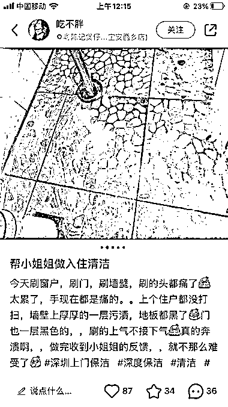
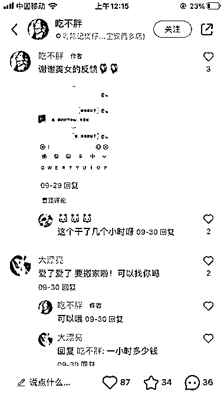

# 小红书入户清洁服务，吸引广州、深圳租房小姐姐的关注

> 原文：[`www.yuque.com/for_lazy/xkrm14/xwrqqlg0a7rfqoqg`](https://www.yuque.com/for_lazy/xkrm14/xwrqqlg0a7rfqoqg)

作者： 云中一尾好龙

日期：2023-10-31

点赞数：**45**

* * *

正文：

入户清洁，看见最近有人搬家刚好看见小红书有这块服务。深圳、广州这种服务在小红书上应该蛮受欢迎，很多有房或者租房小姐姐不愿意自己搞入户卫生。通过晒清洁前后图片强烈对比反差，吸引很多意向客户。这个变现块，她们按小时算，不过是力气活。小红书是个人做，在哔站看见团队做的，粉丝有 50 万。团队的价格很高，目标客户是一些比较难搞的入户业主或者租户。下红书的价格低很多。但是胜在变现直接。

* * *

评论区：

胖大魔 : 应该是微信群叫家政吧

张万敏 : 是的，没错，贵州有资源整合的强制也在做

刘土豆 : 这让我一下想到了另一个项目[阴险]

* * *

公众号懒人找资源，懒人专属群分享