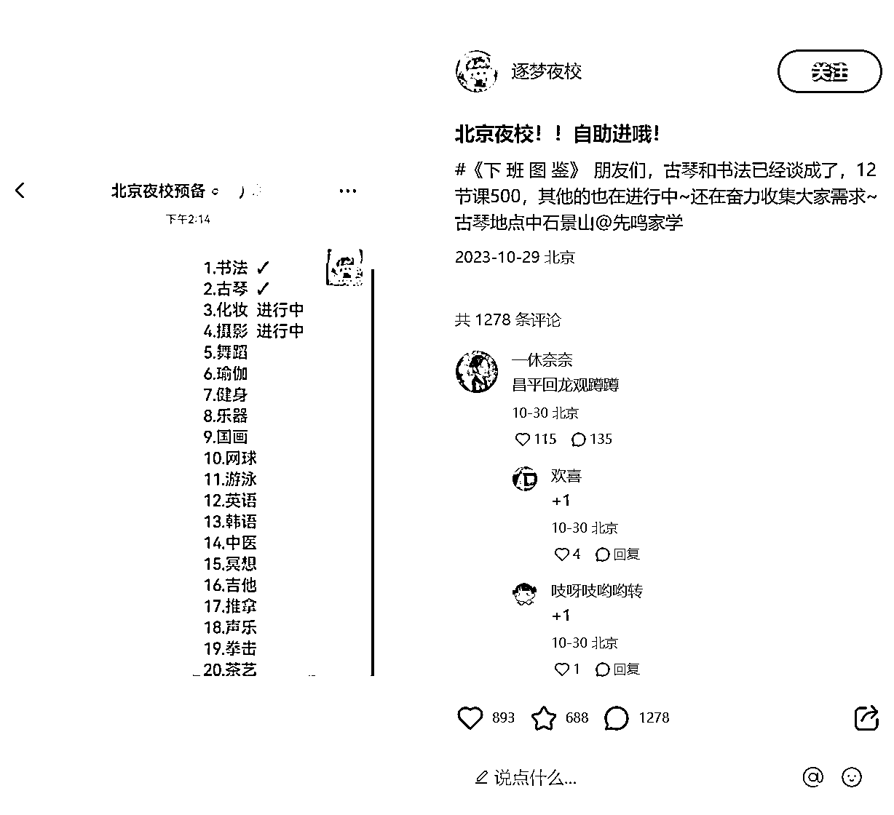

# 商家团购版夜校：小红书上的新经济玩法

> 原文：[`www.yuque.com/for_lazy/xkrm14/tv6va63slx7t7amc`](https://www.yuque.com/for_lazy/xkrm14/tv6va63slx7t7amc)

作者： 田新一

日期：2023-11-06

点赞数：**90**

* * *

正文：

分享一个纯中介的玩法：最近夜校因为其价格低变得特别火，但是政府搞得夜校太难抢，于是衍生出了新的经济——商家团购版的夜校。原理就是在小红书上组团，然后去找商家谈一个低价，中间赚一个差价。培训的商家因为时间的空挡以及可以低转高，也乐于收人，目前上海、北京、甚至秦皇岛都有账号在做了，其实全国市场都可以做，大家可以做自己当地的市场。

* * *

评论区：

田新一 : 后端收益除了差价还会有其他方向，比如说作为空间墙收广告费（相亲、征友、找搭子、租房等），或者设计引流课利润与商家对半分+升课的 cps，可以把这个项目作为单独的盈利项目，也可以作为本地生活的切入点，进而拓展其他业务。有想法的同学欢迎一起讨论[呲牙]

someone so* : 田兄优秀啊

Chris 南酥 : 想做，微信号多少

朱朱侠 : 因为这一条风向标，看完了你主页所有的风向标，膜拜大神[坏笑]

田新一 : 谬赞了😂

田新一 : Txinyi0215，备注夜校，人多的话我拉群

田新一 : 您过奖了[呲牙]

能量菌 : 还有消费降级的因素

* * *

公众号懒人找资源，懒人专属群分享