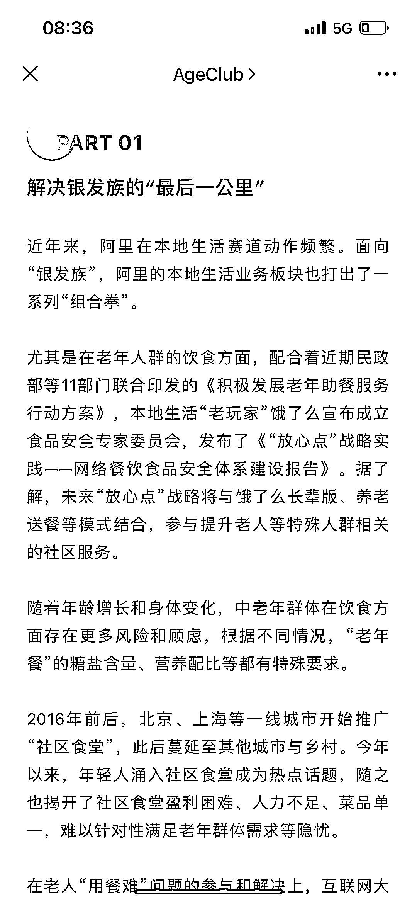

# 中老年本地生活需求成创业新机遇，互联网大厂竞逐 2.8 亿“银发族”增量

> 原文：[`www.yuque.com/for_lazy/xkrm14/bog6mk344uag4opc`](https://www.yuque.com/for_lazy/xkrm14/bog6mk344uag4opc)

作者： 高杰

日期：2023-11-06

点赞数：**41**

* * *

正文：

作为本地生活的创业者来说，可以关注一下中老年的本地生活需求，从社区食堂外卖到家，中老年摄像以及其他相关的细分品类，除了大厂的布局，小团队也有相关的机会
[互联网大厂鏖战本地生活，增量在 2.8 亿“银发族”？](https://mp.weixin.qq.com/s/9zImbhHr1FP1lKZmBhvwtA) 

* * *

评论区：

* * *

公众号懒人找资源，懒人专属群分享