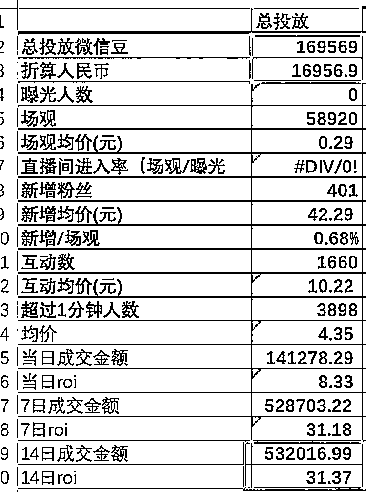

# 视频号 2.0 投放红利期，14 天 53 万成交，ROI 接近 32！

> 原文：[`www.yuque.com/for_lazy/xkrm14/ezmuwgvsegbrtdq6`](https://www.yuque.com/for_lazy/xkrm14/ezmuwgvsegbrtdq6)

作者： 🍀刘驴💥

日期：2023-11-15

点赞数：**54**

* * *

正文：

转自：润宇票圈 视频号 2.0，哈哈，真的是投放红利期。
​我们在孵化投放的一个号，1.7 万成本进去，14 天 53 万成交出来，娃哈哈，接近 32 的 ROI，我滴妈！赶紧追加计划！视频号目前的流量池，给我一个感觉，就是未开荒

* * *

评论区：

冰是睡着的水 : 直播吗还是短视频

潮州痞子蔡 : 直播，不过很快出新政策，门槛会提高一点，接下来这块的红利将会被有些实力的商家给占据了，对于个体来说不贪、不追求规模还能赚一些

乘风破浪 : 什么品类，也不是都能那么高的 ROI

* * *

公众号懒人找资源，懒人专属群分享