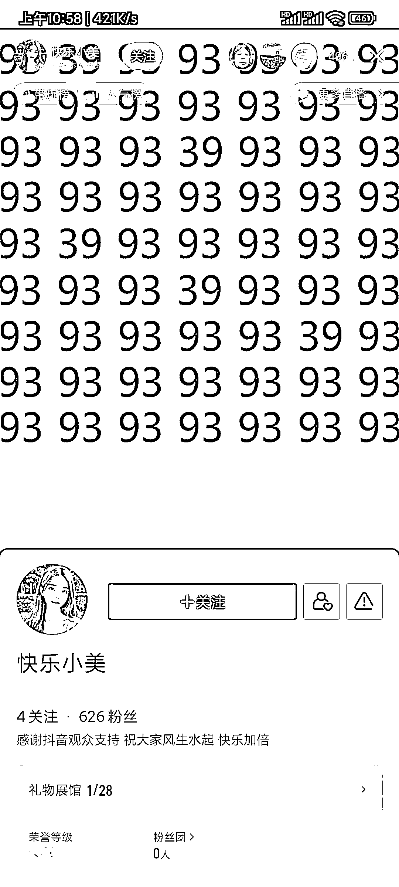
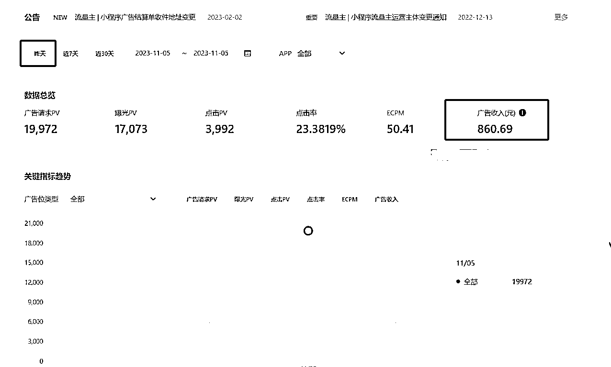

# 抖音直播间的无人直播和小程序流量主，收入真香

> 原文：[`www.yuque.com/for_lazy/xkrm14/rspt1mh1kbh76mdz`](https://www.yuque.com/for_lazy/xkrm14/rspt1mh1kbh76mdz)

作者： 小小米

日期：2023-11-14

点赞数：**63**

* * *

正文：

抖音直播间最近看到更多的【无人直播】撸【小程序流量主】，直播场景单一（一张图片打天下），收入真香（见下图）；
先撇开偏见：前几年就看到有这样的形式了呀？还很 low！不新鲜！但，为啥一直有人做？ 【准备】 1.
去注册一个抖音开发平台（因为需对公打款，需要企业或个体）； 2.
部署小程序（不会开发不要紧，去买一个，很多是集成的小程序，即一个小程序里有很多个主题小程序，直播哪个主题，就挂哪个主题的链接）； 3.
完活，准备打，拿收益。 【打】 1\. 听说前期很多都是买量、刷量的，那是暴利啊（月入 30W 可以达成），最近平台打压了==死号； 2.
现在的玩法基本是两种： a、发视频/图文，带小程序链接，引导打开小程序； b、直播挂小程序链接，还是引导 【直播】 1.
真人直播，不露脸的，手机直播或电脑直播，就是一张图片； 2\. 无人直播，也是一张图片，直接播放录的音频； 【风险点或资源】 1.
实名的抖音号，开播需要； 2\. 对公账号，提现用； 3\. 多手机，想扩大收益，得矩阵； 4.
初期投入 1000 左右，买小程序（如果自己手撸当我没说，但，还是买的香，因为时间问题）； 5\. 无人直播，需要注意无人直播的细节，做好
号阵亡的准备，新起号的准备（如果某号的直播数据上来了就珍惜吧）； 6\. 细节，如：0 粉直播挂小程序（官方规则是千粉可挂，但人家不足千粉，就是能挂）；
【小结】 1\. 门槛较低； 2\. 收益真香。

* * *

评论区：

小小米 : 主要是找不同，测评，麻将等

* * *

公众号懒人找资源，懒人专属群分享