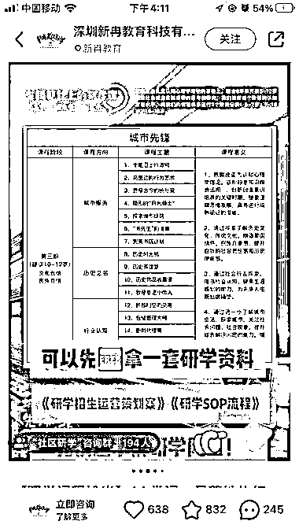
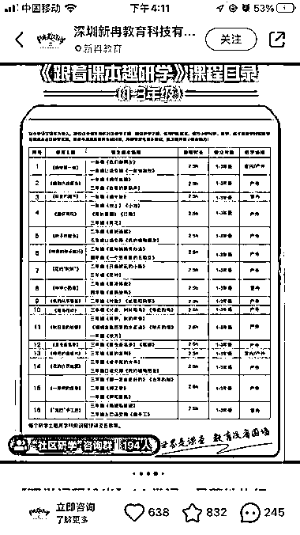
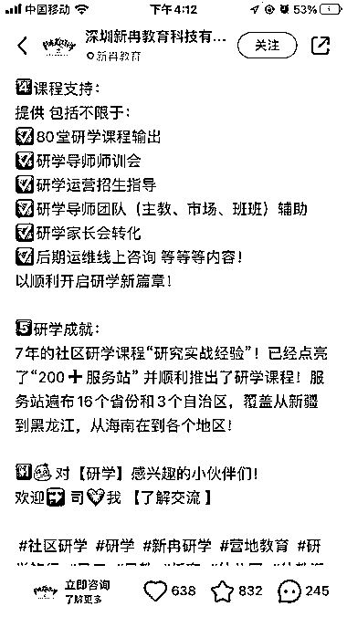
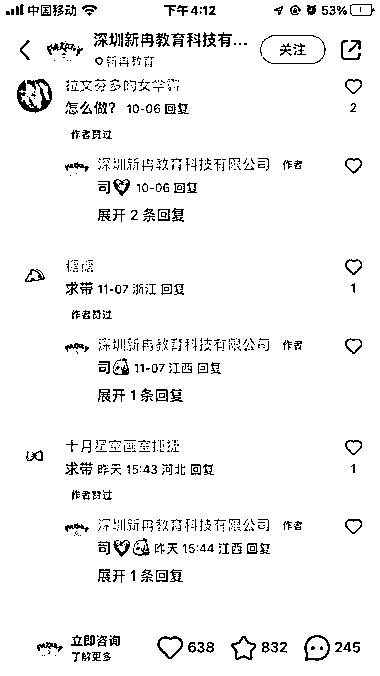

# 社区研学：国内新兴的教育

> 原文：[`www.yuque.com/for_lazy/xkrm14/ggc8rxw2xsxxqgya`](https://www.yuque.com/for_lazy/xkrm14/ggc8rxw2xsxxqgya)

作者： 星辰

日期：2023-11-16

点赞数：**72**

* * *

正文：

之前看到都是国外游学，今天忽然发现一个社区研学，第一次听说……

* * *

评论区：

星辰 : 脑洞大开，感觉身边处处都可以当做学习的题材啊！

张小悦 : 这是城市规划专业＋少儿教育呀

星辰 : 说实话，现在的教育培训行业，花样真多😂

张小悦 : 再找个规划大咖给背书，价格还能比同类涨点

* * *

公众号懒人找资源，懒人专属群分享