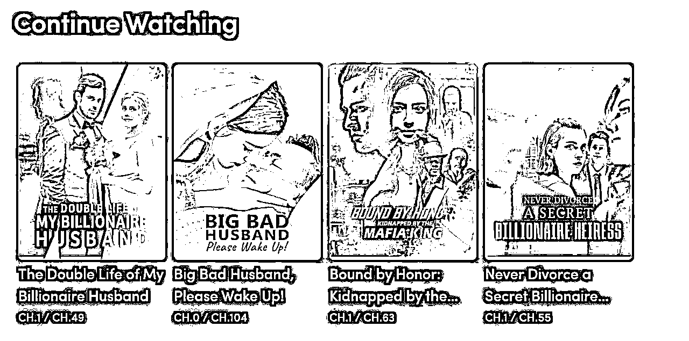

# 中国土味文化在海外免费 app 排行榜上大热，引发观众疯狂追剧和求资源

> 原文：[`www.yuque.com/for_lazy/xkrm14/izwx7rg34fs4qhag`](https://www.yuque.com/for_lazy/xkrm14/izwx7rg34fs4qhag)

作者： 小魏从 0 开始做副业

日期：2023-11-13

点赞数：**62**

* * *

正文：

中国土味文化输出。看国外免费 app 排行榜，排第一的是 temu（海外版拼多多），排第二的是 reelshort（中国短剧平台出海）。我实在好奇让美国的朋友去下载了 reelshort，看看里面都有啥，结果一进去看图推的剧名就有内味了
Never Divorce a Secret Billionaire Heiress 千万不要和秘密的亿万富翁继承人离婚 The Double Life
of My Billionaire Husband 我亿万富翁老公的双面人生 The CEO's Contract Wife CEO 的合同妻子
欧美那边的人比较淳朴，不像中国动动心思能找到不少盗版的，一些观众被勾引的抓耳挠腮，既心疼钱，又想追剧，急的在评论里求资源求剧透的样子，看了想笑。

* * *

评论区：

倪大胖 : 😂绝了

文少 : 哈哈哈哈哈哈优秀啊

* * *

公众号懒人找资源，懒人专属群分享