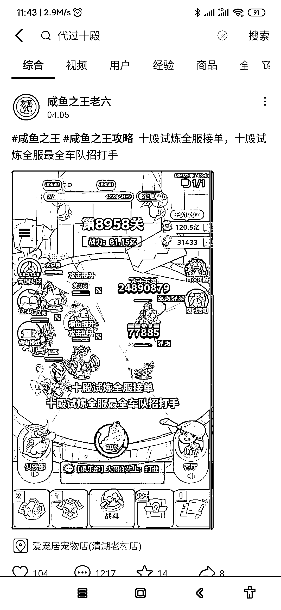
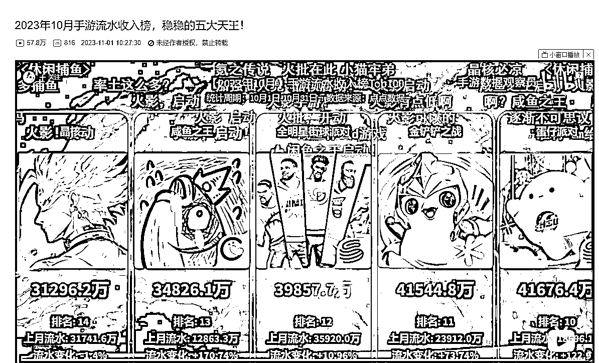

# 闲鱼之王微信小程序流水 3.4 亿，却只排行第十三

> 原文：[`www.yuque.com/for_lazy/xkrm14/ogbaagdsby2rrzvd`](https://www.yuque.com/for_lazy/xkrm14/ogbaagdsby2rrzvd)

作者： 日乾

日期：2023-11-24

点赞数：**59**

* * *

正文：

网赚圈外的小信息差 下图是微信小程序咸鱼之王，今年 10 月流水就已经到了 3.4 亿，但也就排行第十三。
先说赚钱信息，咸鱼里面有一个十殿副本，需要氪佬带队才能打，打通 7 殿，一次 648，能面向所有百服都可以招收。
【可以起抖音号，利用抖音势能链接氪佬和平民，做带队服务】 【实际是其他高流水游戏，一般都是各类战斗社交，实际是这里面都有着各类信息差】

* * *

评论区：

* * *

公众号懒人找资源，懒人专属群分享