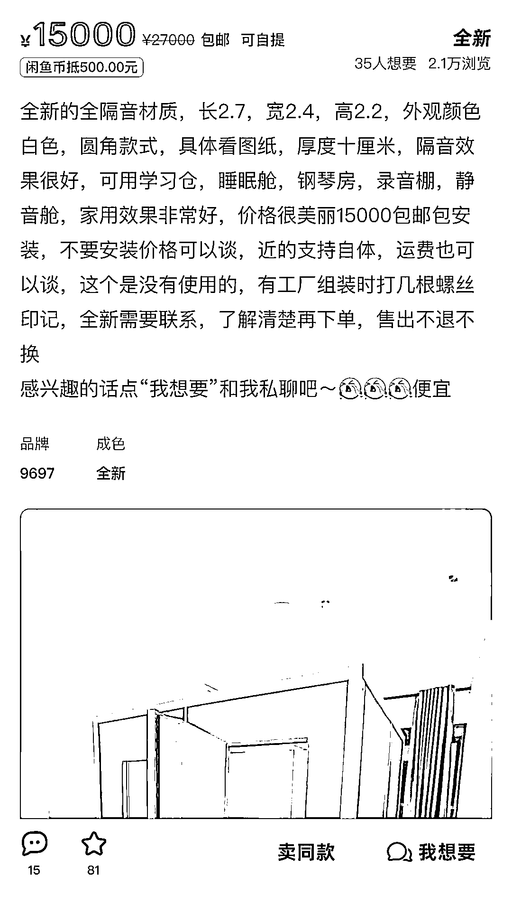

# 睡眠隔音仓：现代打工人解压利润可观的市场

> 原文：[`www.yuque.com/for_lazy/xkrm14/bodvb6bp58yook2w`](https://www.yuque.com/for_lazy/xkrm14/bodvb6bp58yook2w)

作者： 芝慧

日期：2023-11-22

点赞数：**63**

* * *

正文：

在闲鱼刷到一个商家卖隔音房隔音仓，问的人还挺多！然后到拼多多搜索居然还有办公、录歌、直播间、睡眠的细分隔音房～客单价高利润可观且销量还挺好！小红书随手一搜还有专门做隔音仓测评的！
感觉现代打工人压力大精神紧绷睡眠质量不好！睡眠隔音仓还是有一定市场的！

* * *

评论区：

芝慧 : 还有很多家里有孩子需要练琴的，尤其孩子一般都是晚饭后练到八九点，很多父母为不影响邻居也会考虑隔音仓！

风雨彩虹🌈 : 会缺氧吗

芝慧 : 哈哈哈哈 闲鱼有个人问了一摸一样的问题，我看商家说不是完全百分百封闭，好像可以通风换气啥的

兰心 : 装空调不缺氧

芝慧 : [强][强][强]

芝慧 : 哇 谢谢老大！

小刀 : 之前调研付费自习室的时候，看到过这样的产品，可以在里边打电话、开会、练习乐器不那么影响其他人，隔音使用的。

* * *

公众号懒人找资源，懒人专属群分享