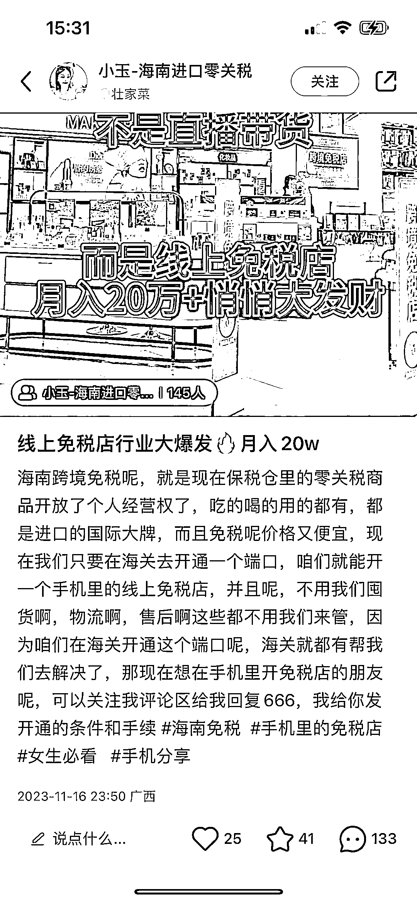

# 海南跨境免税，新的赚钱机会来了！

> 原文：[`www.yuque.com/for_lazy/xkrm14/vsfx7pmqqi3835ya`](https://www.yuque.com/for_lazy/xkrm14/vsfx7pmqqi3835ya)

作者： 阿丢大人

日期：2023-11-22

点赞数：**33**

* * *

正文：

最近在小红书刷到不少关于海南跨境免税的笔记，做的就是央视说的跨‬境零关税电商。 每人每年可享受 2.6 万的‬线上免税额度，
还有 10 万额度是国家给予我们每个人公民享受购买免税品的额度，因为免税店只能开在海南，必须要来到海南购买这免税品才能够享受这个额度的 合作方式有两种
1、店主（做零售）自己购买商城的所有商品享受 8.5 优惠，分享给朋友购买赚纯利润 15%
2、批发（服务商）自己购买商品所有商品享受 8.1 折，分享给朋友赚纯利润 19%，服务商可以招商店主与服务商 以前做过代购的小伙伴可以了解一下这个模式。

* * *

评论区：

溪希 : 小红书抖音知乎有很多相似文案，让人有一种错觉和海关、官方政策有什么关系。联系问了一下，如果没有理解错的话这其实这是一家做跨境电商的公司（自称）的广告，他们在线上招代理，对个人店主用的类似于微商的体系，可卖货，可发展下线，把自己升级成“服务商”后可对外招商。

戴全 : 有详细介绍吗

阿丢大人 : 不过从这个信息可以看出，海南做为免税区应该有政策帮扶，可以多去看看提早布局

溪希 : 是的，这两年海南出台了很多政策，可以看看官方的政策查询解读平台[政策查询解读](https://policy.hnftp.gov.cn/#/)

* * *

公众号懒人找资源，懒人专属群分享