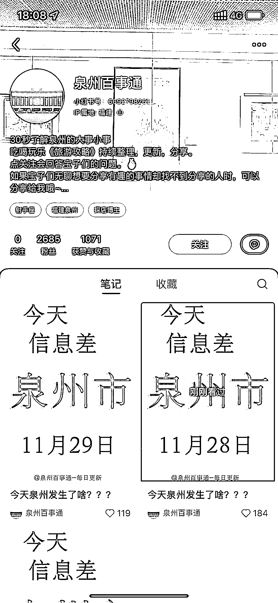
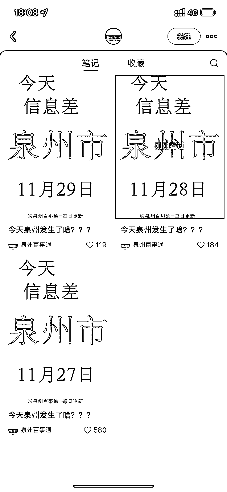

# 小红书同城大字报形式火爆，三篇笔记吸粉 2000 多

> 原文：[`www.yuque.com/for_lazy/xkrm14/ckorqczb0h5m1d0t`](https://www.yuque.com/for_lazy/xkrm14/ckorqczb0h5m1d0t)

作者： 胡北北

日期：2023-11-29

点赞数：**62**

* * *

正文：

小红书同城这种大字报的形式很火，三篇笔记吸粉 2000 多

* * *

评论区：

大美 : 请问这种信息从哪收集呢

麦格雷皮 : 同问

胡北北 : 各个社媒平台关注一下同行账号或者当天的新问早播

子桐 : 变现呢

胡北北 : 都是同城的变现方式有很多啊

韭零后 : 可在信息中增加求职招聘模块，粉丝量起来后和企业谈合作

* * *

