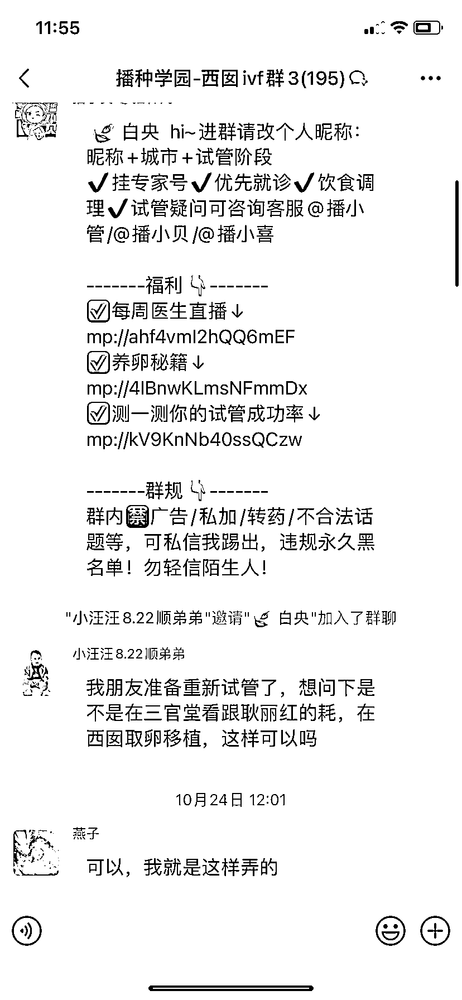
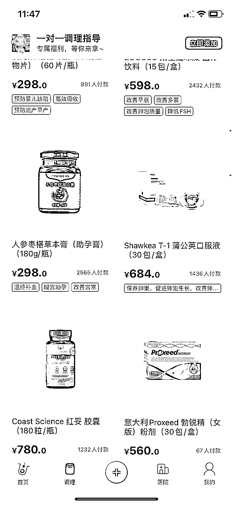
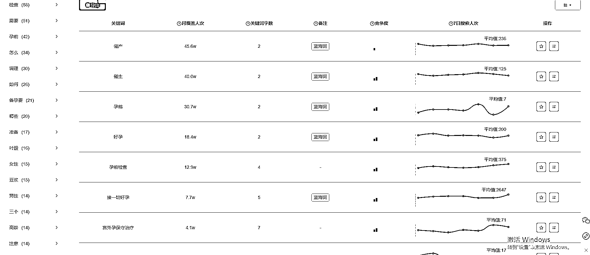

# 小红书发现的试管婴儿 app，意外火爆，群聊人数惊人

> 原文：[`www.yuque.com/for_lazy/xkrm14/uk28de4ud2xgyvp7`](https://www.yuque.com/for_lazy/xkrm14/uk28de4ud2xgyvp7)

作者： 离心之巅

日期：2023-11-29

点赞数：**64**

* * *

正文：

小红书偶然刷到的 app，专注试管婴儿，随便下载看看，本以为不会很火，没想到群聊都有几十个。 1.每个群都有医生答疑，信任感很高
2.能做试管的都是高客单女性人群，男性也不会关注这种 app。里面发帖小眼睛都很不错，不过目前没见有人引流。 3.自带的商城数据也很不错，app-小程序-
微信群-商城。多方面触达用户，成交丝滑。并且从备孕-试管-养胎-出生，各个环节都有成交的可能性。
4.这种小众赛道做 seo，用户非常精准。极客搜索备孕，相关词热度也比较高

* * *

评论区：

亚瑟王 : 图 5 是什么工具了？

离心之巅 : 极客增长，可以看看鱼丸这个帖子[如何挖掘关键词，并找到合适自己的项目](https://t.zsxq.com/14JIwamR2)

李花弹 : 这是什么 APP

离心之巅 : 试管婴儿

亚瑟王 : 收到，感谢🙏

* * *

公众号懒人找资源，懒人专属群分享