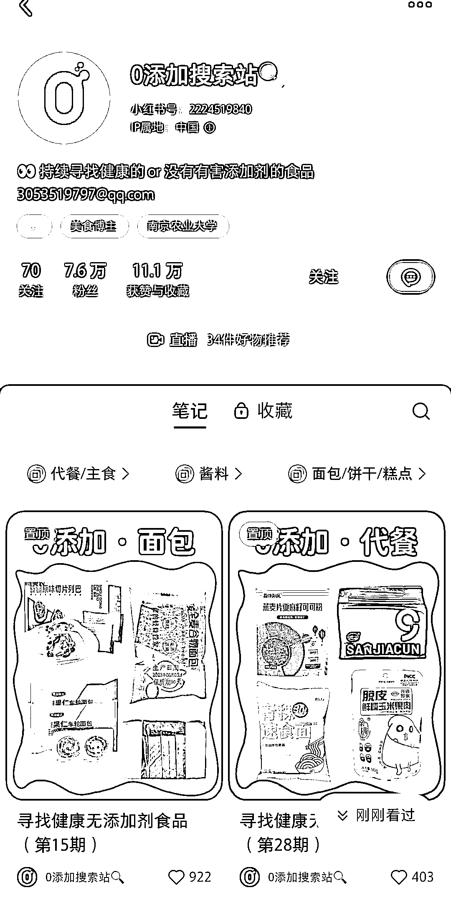
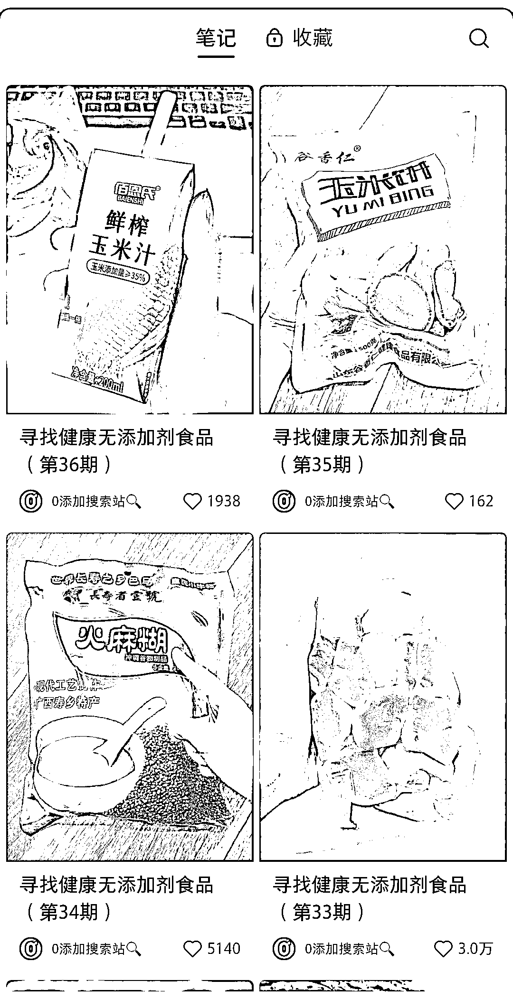

# 小红书健康食品推荐账号，短短一个多月已有七万多粉丝

> 原文：[`www.yuque.com/for_lazy/xkrm14/biv0hf8c3omcak0f`](https://www.yuque.com/for_lazy/xkrm14/biv0hf8c3omcak0f)

作者： Jay

日期：2023-11-30

点赞数：**108**

* * *

正文：

主打健康类的食品推荐，才一个多月三十多篇笔记已经七万多粉丝了，挂商品链接和接商单都可以，笔记数据也很好，还有不少粉丝在下面互动和推荐产品的

* * *

评论区：

朱朱侠 : 在食药监局官网应该可以查到所有在售流通的食品数据[这样可以做一个系列笔记]每天一款 0 添加食物[或者每天一款 0 糖食物（针对糖尿病患者）]除了人的~宠物的也可以

i : [强]

* * *

