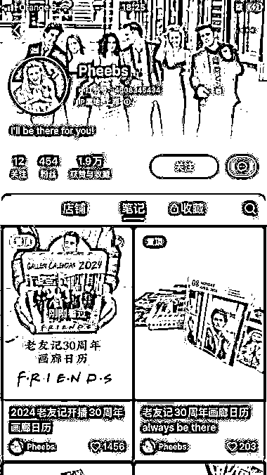

# 小红书老友记自制年历销售火爆，适合复制到其他高热度 IP 上去

> 原文：[`www.yuque.com/for_lazy/xkrm14/cfw20x0o26yhk8eh`](https://www.yuque.com/for_lazy/xkrm14/cfw20x0o26yhk8eh)

作者： Jing

日期：2023-12-01

点赞数：**43**

* * *

正文：

【小红书老友记自制周边年历】 - 老友记自制年历卖了 860 份（近 15 万） - 虽然粉丝不多但也无所谓，主要为了销售 - 内容也几乎就是展示产品，好操作
- 可以买点付费推广我觉得？因为我经常刷到 - 这个模式适合复制到其他高热度的 IP 上去 [咖啡]
挑战是要去设计生产囤产品，有一定成本，但我觉得设计靠 AI 工具轻松解决，如果找到能小批量先生产然后超出做预购还是可行。 [猪头]
说得我自己都想去做一个看看了。

* * *

评论区：

刘皇叔 : 做个武林外传之类，应该需要授权吧

Jing : 其实理论上都要。但是老友记那些周边都没有授权的……SO

刘皇叔 : 毕竟老外的没那么严吧

Jing : 哇～～～第一次发帖就中标。开心旋转。

Jing : 主要是远，人家也确实管不到。所以要做的话还是做海外 IP 比较好。豆瓣影视拉出来，我觉得动画类应该市场更大，用户购买力也很好。

💕大橙 C🍊 : 这个还是版权问题吧，而且这个我买了，就它的质量而言，讲真不值这么多钱[Emm]

Jing : 你买了就说明整个推广到购买的路径对方最的还不错。而且绝大多数人也是一次购买，回头客应该很少。毕竟谁也不会每年都买一次同样 IP 的年历。至于版权，这种小体量不太会有版权方真的来搞，真投诉了就下架关店最严重吧。

* * *

