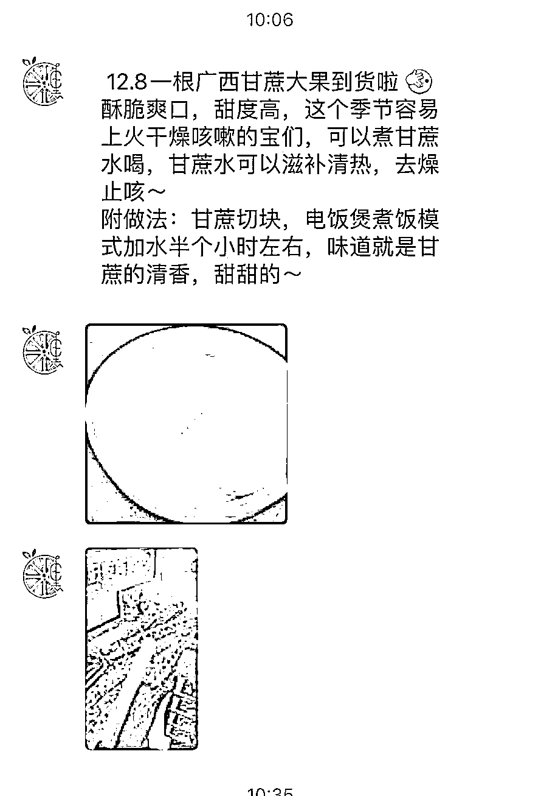

# 抖音引流+微信群优惠，实体水果店成功打造个人 IP

> 原文：[`www.yuque.com/for_lazy/xkrm14/gnneiunlmff98xn3`](https://www.yuque.com/for_lazy/xkrm14/gnneiunlmff98xn3)

作者： 周末

日期：2023-12-01

点赞数：**95**

* * *

正文：

这是身边下线实体水果店，每天都会在群里推荐水果，不单单是发广告还搭配水果多种搭配吃法，这样的广告用户不容易排斥
我觉得老板很聪明，他是抖音本地引流到门店，去到门店的人都会让加微信（进微信群享有一定的优惠） 再通过快团团在群里时不时搞预售发特价水果抢购
再通过发展代理，让比较远的乡镇地区也能吃到他们店的水果，知道他的水果店名字
他开店一年已经开了十几家分店，把水果店做成了个人 IP，抖音也会分享做好事，就是每个月去一个周边敬老院送关怀，也发动想跟他一起做慈善的商家抱团，他的客户很有粘性，大家可以参考一下

* * *

评论区：

朱朱侠 : 搭上了本地生活的风口

空城 : 这个水果店很有意思，能否告知抖音账号研究一下！

李治国 : 同问抖音帐号

Harry Sun : 同问抖音帐号+1

代码君 : 同问抖音帐号+1

@ 赵凡珍 : 同问抖音账号+1

一只鸵鸟 : 便宜是硬道理

* * *

