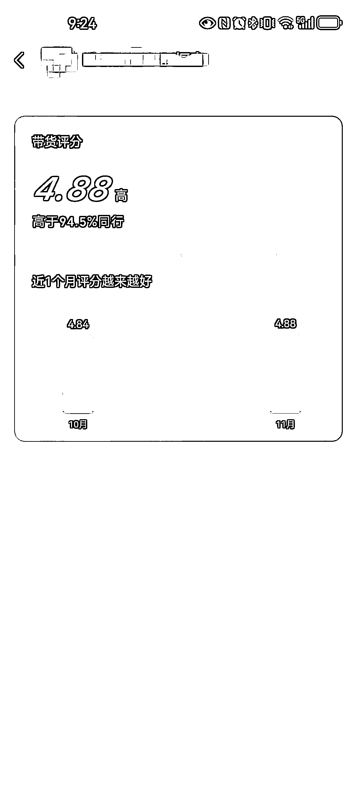
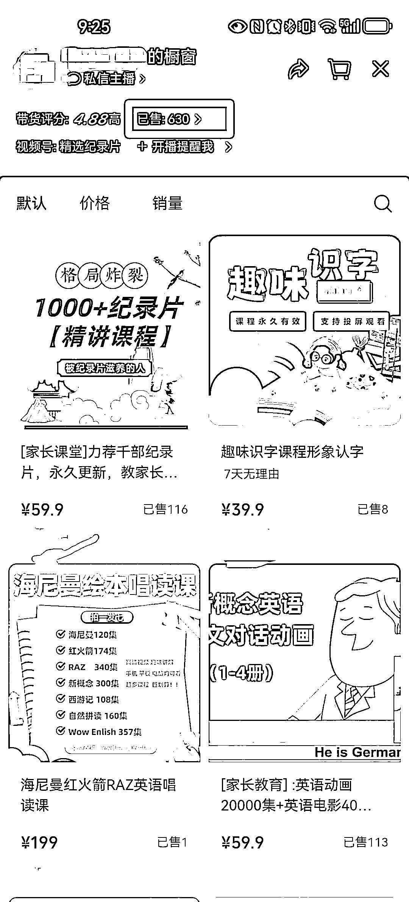
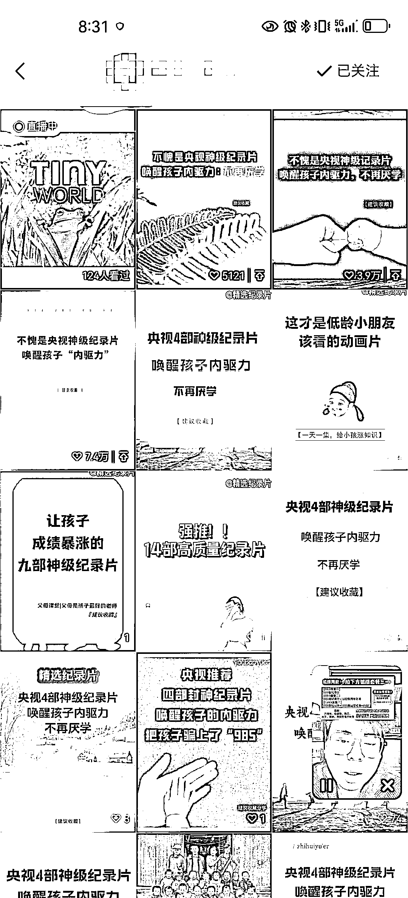

# 低门槛赚钱机会，视频号宝妈纪录片带货销售额超过 12 万

> 原文：[`www.yuque.com/for_lazy/xkrm14/hggb7bktfmngn4k1`](https://www.yuque.com/for_lazy/xkrm14/hggb7bktfmngn4k1)

作者： 华闻

日期：2023-11-29

点赞数：**116**

* * *

正文：

#视频号 低门槛的赚钱机会，适合新手，也适合团队放大。 最近跟了一个账号近两个月，看着他 0-1 做起来，小朋友纪录片&动画视频带货。 先说效果：
单号一个半月销售额范围 37737 元～125937 元。 10 月 16 号开始发视频，到现在橱窗累计卖出 630 单，客单 59.9，99.9，199.9 三种。 模式：
一句话，简单的不能再简单。 内容： 前面一个月基本都是图文播放，素材取自小红书各种纪录片分享号的图片，然后截图后（水印都没去掉）就配音发。 直播：
刚起步出现了一个三百多赞的视频后马上开始直播，直播时间为晚上，周末白天，上班午休期间。。 大概这月初他们开了个新号复制，继续纯搬运图片发视频，然后分别直播。
货源： 都是百度网盘发货，货源去拼多多找了下基本都是几块钱到十几块钱以内搞定上百部纪录片。 利润： 成本才十几块以内，客单最低 59.9，利润惊人。 总结：
视频号宝妈多，关心小朋友成长。赛道刚需利润高 虚拟资料售后简单无需实体发货。 难点： 对于新人而言，
如何从小红书或抖音等渠道找到好内容，且能持续大量发，熬过冷启动。但对于专业同学来说这简直就不叫难度，基操而已。
对于老手，直接上几个号无脑对量，吃到这个红利。同时引导加 v 留存宝妈粉，朋友圈继续转化，客单可以做到大几百。 啰嗦了。 年底了大家猛干快干赚多点。

* * *

评论区：

花满楼 : 现在小红书可以卖这种虚拟的？

华闻 : 加私域卖

一只鸵鸟 : 同样的文案小红书我也看到笔记爆了的

Marco : 不错

华闻 : 短视频加直播的变现效率更大

冬日暖阳 : 要怎么做呢

刘皇叔 : 这种版权的风险怎么避免呢？

华闻 : 和写公众号发视频用素材面临一样的版权挑战。

* * *

