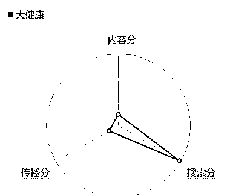
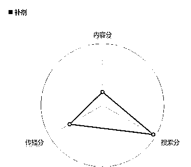

# 如何判断一个项目是蓝海还是红海？学会使用巨量算数！

> 原文：[`www.yuque.com/for_lazy/xkrm14/aqyunb5k6iolgu7q`](https://www.yuque.com/for_lazy/xkrm14/aqyunb5k6iolgu7q)

作者： 豆哥

日期：2023-11-29

点赞数：**92**

* * *

正文：

判断一个项目是蓝海还是红海的方法，学会使用巨量算数，搜这个行业的关键词，有三个指数，内容分，传播分和搜索分，内容分指带这个关键词有多少人在发相关的内容，搜索分代表有多少人关注这个话题，传播分代表这个关键词大概的播放量，我们要找蓝海赛道，就找传播分搜索分高，内容分低的，做这种内容的竞争就小很多，学会这个，进阶一下，切一个大的赛道，做细分垂直领域，一样通过关键词，一级一级找，先入场的才有红利。

* * *

评论区：

♻️李拜五💥 : 为什么我搜了几个关键词，女装，零食，全是这样的，就没见过传播内容分高的

尺子白 : [强]

豆哥 : 大行业，都不会带这种关键词，通常是现阶段高利润的内容分更高，已经很成熟，很卷的领域，不会带这种大类目的关键词，通常转很具体的词吃更多的流量

* * *

