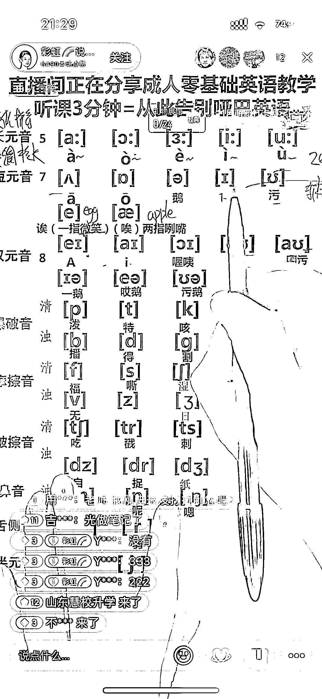

# 自然拼读直播，适合 K12 转型的老师，卖 39.9 的图书实际上是卖客资给机构

> 原文：[`www.yuque.com/for_lazy/xkrm14/osy0104qao3qu6dr`](https://www.yuque.com/for_lazy/xkrm14/osy0104qao3qu6dr)

作者： Lemon

日期：2023-11-29

点赞数：**80**

* * *

正文：

自然拼读直播，适合 K12 转型的老师，纯脚本化，基本上过高中都能讲，多看几个直播间就发现内容一模一样。卖 39.9 的图书，实际上是卖客资给机构，目测有效客资一单得 100➕，纯自然流，下图前两个是几百粉的新号，第三个也才万粉而已，这个收益感觉一场得过万了

* * *

评论区：

老张 : 厉害

一诺 : 原来如此

小安同学 : 卧槽，收益这么高！！！

刘皇叔 : 这个很香啊

甜橙 : 厉害了，柠檬姐

* * *

公众号懒人找资源，懒人专属群分享