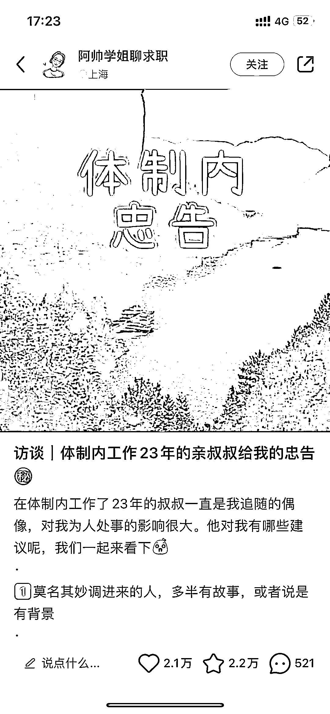
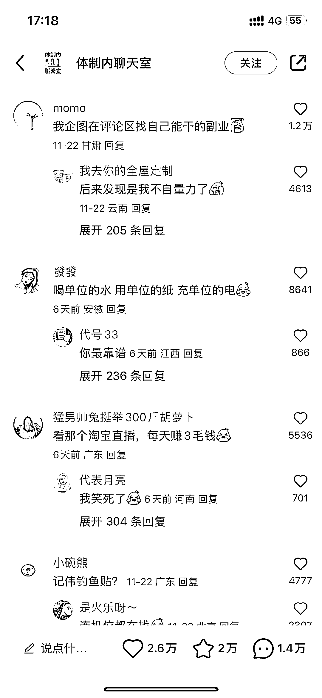

# 体制内关注副业和社交礼仪，可开发相关课程

> 原文：[`www.yuque.com/for_lazy/xkrm14/vgoz4s9dlc5wikhd`](https://www.yuque.com/for_lazy/xkrm14/vgoz4s9dlc5wikhd)

作者： Newboy

日期：2023-11-29

点赞数：**64**

* * *

正文：

体制内关注副业和社交礼仪的挺多，关注、收藏、评论可真多。可开发体制内副业课、礼仪课。

* * *

评论区：

* * *

