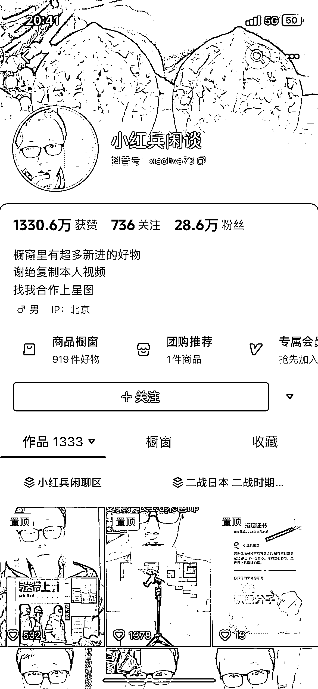

# 简单拍摄，高效带货，这个账号的数据让人惊叹！

> 原文：[`www.yuque.com/for_lazy/xkrm14/onagqvd9ow83pbeb`](https://www.yuque.com/for_lazy/xkrm14/onagqvd9ow83pbeb)

作者： 三番

日期：2023-11-29

点赞数：**72**

* * *

正文：

看这个账号，拍摄手段简单，带货数据好的一塌糊涂。 仔细观察这个账号，基本上架台手机，找个白墙就能拍。叠加一个原视频画中画，完全不会抓重复度。好处很多：
1、叠加的视频大多数都是爆款，产品本身不错； 2、视频产出效率极高，熟练之后拍视频+写文案也要不了多久；
我看了他的数据，单月 GMV 在 25[50W 之间，带的产品大部分佣金在佣金在 20]25%，粗略估算下，这个月就能拿到 5~12W 之间，不确定玩具类目的退货率，按照 10%来算，他能拿到手的佣金也要大几万了。
有能力和需求的圈友可以测试下，几乎没有成本，可以批量上号，大量怼内容批量起数据。同时这大哥运营思路还有点小问题，我看到很多爆了的视频也不好好利用下，换成我来，爆了的视频我肯定每天拼命发，反复发，再使劲的模仿爆的模板重复拍，一直到没有流量为止，榨干这条内容的最后价值。

* * *

评论区：

三番 : 这个内容产出还可以扩展一下，除大件产品之外，都可以用这个方式大量出内容

三番 : 补充一点，这个豆荚也很好投，起号应该会容易点

斌斌聊播客 : 搜到了一个小号。

三番 : 估计号不少呢

斌斌聊播客 : 是的

Sugar : 主要想不出他这个文案

威曹 : 他这号有发流量视频，这是关键

* * *

