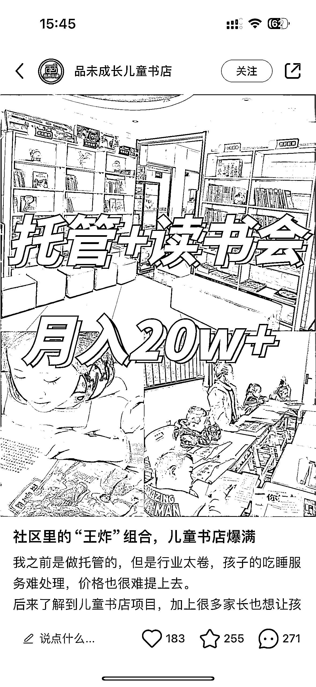

# 教培转型儿童书店加盟，小红书获客效果显著

> 原文：[`www.yuque.com/for_lazy/xkrm14/px2tklg09nwgthl7`](https://www.yuque.com/for_lazy/xkrm14/px2tklg09nwgthl7)

作者： Lemon

日期：2023-11-29

点赞数：**58**

* * *

正文：

教培转型儿童书店的加盟，小红书获客，低粉高赞，全是精准用户。目前大量教培人欲谋出路，这种目测都还没有形成品牌化，个人认为可冲。如果能结合家庭教育就更棒了！

* * *

评论区：

Lemon : 另外，抖音投放也很香

刘皇叔 : 两间屋子，一间是孩子的读书会，另一间是家长的育儿课[呲牙]

亦威 : 没有资质不是不能办培训机构吗

Lemon : 书店不是培训，资质针对的是需要上课的机构

* * *

公众号懒人找资源，懒人专属群分享