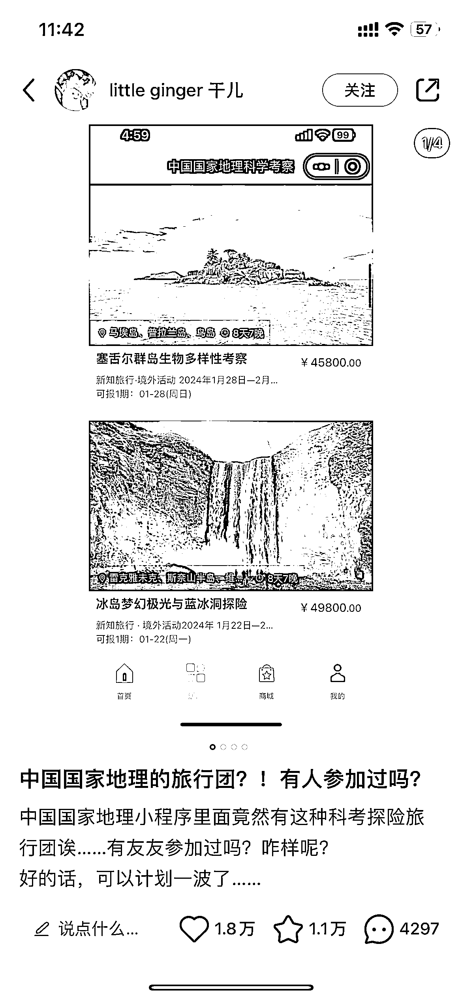

# 中国地理旅行团：高价值的学习与体验之旅

> 原文：[`www.yuque.com/for_lazy/xkrm14/mamsv6ygt343y95y`](https://www.yuque.com/for_lazy/xkrm14/mamsv6ygt343y95y)

作者： Loo'K

日期：2023-11-28

点赞数：**49**

* * *

正文：

最近中国地理旅行团实在是太火了，价格整体比较昂贵，国内差不多按 2000/天算，国外更贵，优势在于以下点 1\. 平台响亮，有保证 2.
带队的都是教授，研究员，学习到的不少 3\. 吃住很不错，有摄影摄像 以上可以想到： 初高中生学生夏令营组织，一边是初高中生，另外一侧是招聘 在读 985
大学生，由此带队去一些人文或者自然地点，现在的家长鸡娃也是想要他们考好的学校，但是内容之类的还没想好

* * *

评论区：

Loo'K : [呲牙][呲牙]谢谢

* * *

