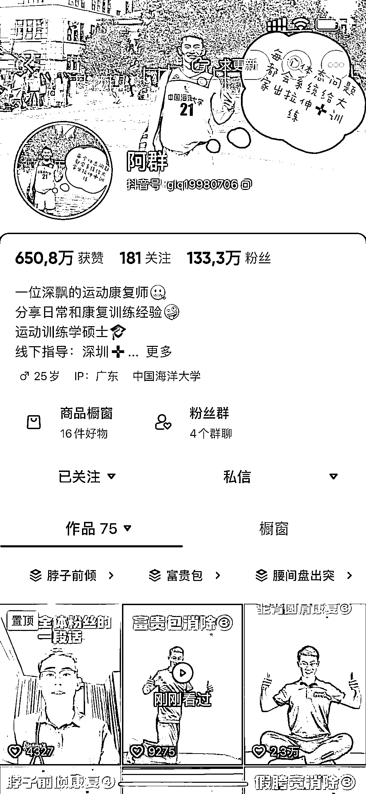

# 运动康复领域的机会与抖音博主的成功案例

> 原文：[`www.yuque.com/for_lazy/xkrm14/gy7vkkms4pc4lw07`](https://www.yuque.com/for_lazy/xkrm14/gy7vkkms4pc4lw07)

作者： 鲨鱼

日期：2023-11-28

点赞数：**49**

* * *

正文：

运动康复领域。 随着健身的普及+中老年社会化，康复类领域必定会有大量的机会。
这个抖音博主，最近起号特别猛，橱窗只是顺带卖下货，大头还是在私域。且有康复需求的粉丝，一般消费水平都不低，无论是服务类，还是后续嫁接做其他类目的产品，也都有很大空间。

* * *

评论区：

* * *

公众号懒人找资源，懒人专属群分享