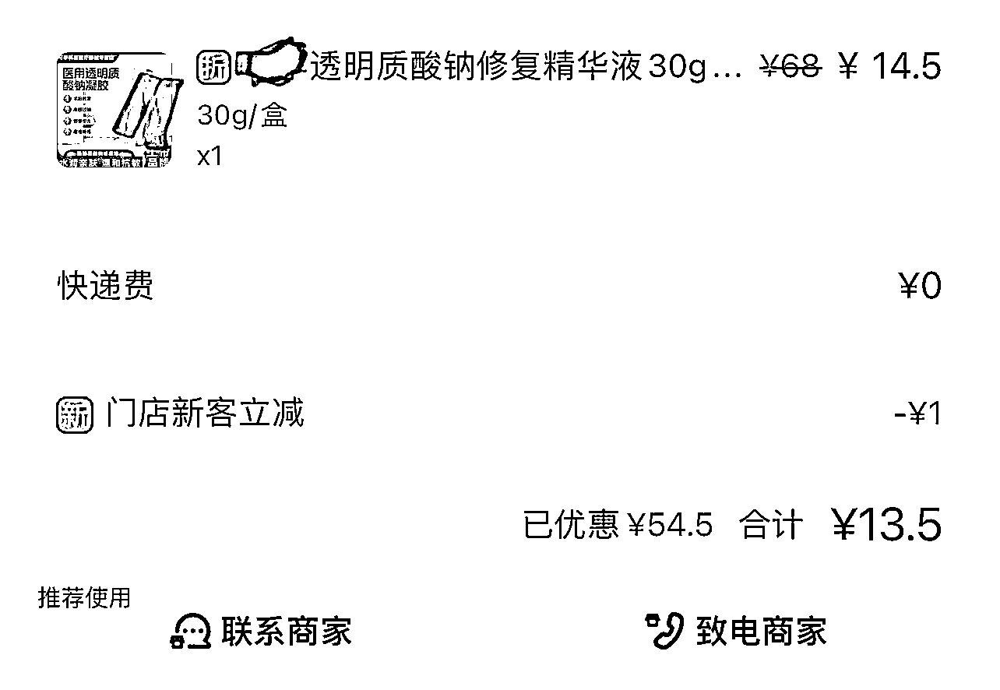

# 同一工厂生产，贴牌售价相差十倍，揭示品牌溢价现象

> 原文：[`www.yuque.com/for_lazy/xkrm14/ck858rg4y4wguv3f`](https://www.yuque.com/for_lazy/xkrm14/ck858rg4y4wguv3f)

作者： 安小竹

日期：2023-11-27

点赞数：**50**

* * *

正文：

工厂生产后贴牌，售价可差十倍。
以偶然发现的一个有趣的事情为例：二甲医院药店 159 元购入的修复液，与美团买药售价 13.5 元的修复液成分完全一样。相同的产品名称（医用透明质酸钠修复液），相同的产品成分，为何售价相差 10 倍？
仔细对比两个产品的信息，发现两个产品不仅成分完全相同，医疗器械注册证编号也一致。通过国家药品监督管理局官网，查到注册公司为某生物科技有限公司。
查阅该公司官网、微信公众号，可知该公司致力于提供医用透明质酸钠修复液等多种产品代生产服务。联系该公司 400 电话，可知售价 159 元与预售价 13.5 元的产品均由该工厂代生产。问 1：十倍差价下的生产配方区别。厂方答复：生产配方区别不大，护肤效果一致，包材成本有区别，大部分为品牌溢价。问 2：提供品牌名称与包材，即可定制产品？厂方答复：可以，产品可按照消费者喜好调节黏度等性状，有效成分按照标准配方生产即可。
同一个工厂生产，贴上不同的品牌，可以卖出 10 倍以上的售价差异。

* * *

评论区：

BLUE : 保护

* * *

