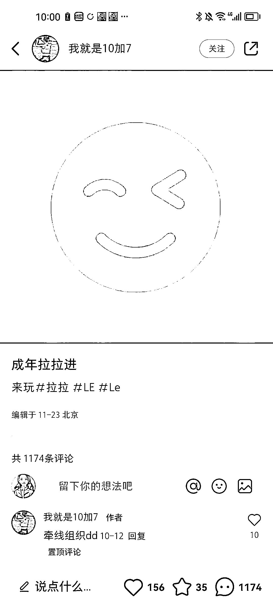

# 利用拉拉群作为营销风向标，吸引大量流量并实现变现

> 原文：[`www.yuque.com/for_lazy/xkrm14/gaxal5oxx2whq332`](https://www.yuque.com/for_lazy/xkrm14/gaxal5oxx2whq332)

作者： 胡恩惠

日期：2023-11-27

点赞数：**46**

* * *

正文：

#风向标 拉拉群 随便点一个看看评论区，就知道流量有多大 营销思路及建议：前期可以免费进群，先积累第一批种子用户，后续可以按照城市分群（收费） 北上广深杭
成都厦门重庆等一线城市优先做 后端其他变现方法可以参考目前市面上成熟的相亲群玩法

* * *

评论区：

* * *

