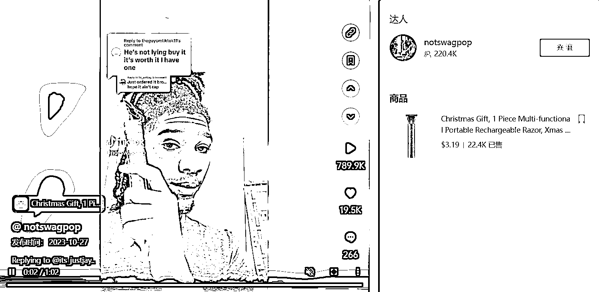

# 专业毛发修剪器，碳钢和自锐陶瓷刀片，方便携带

> 原文：[`www.yuque.com/for_lazy/xkrm14/ysfgut8fxepyrupn`](https://www.yuque.com/for_lazy/xkrm14/ysfgut8fxepyrupn)

作者： 兰心

日期：2023-11-28

点赞数：**43**

* * *

正文：

专业毛发修剪器的刀片由碳钢和自锐陶瓷制成，可轻松修剪头发、胡须、鬓角、面部。R 形钝边设计使与皮肤的温和接触，可以更好地保护皮肤。充满电 2.5
小时后工作时间至少 180
分钟。动力强劲、锋利、修剪毛发均匀，同时噪音控制低，方便旅行携带。1688 拿货 7.4，TK 小店 3.19 美金卖了 2 万多单，这个产品在其他平台几年前就火过了，现在 TK 可以继续走一波。

* * *

评论区：

兰心 : 感谢亦仁大大！

* * *

