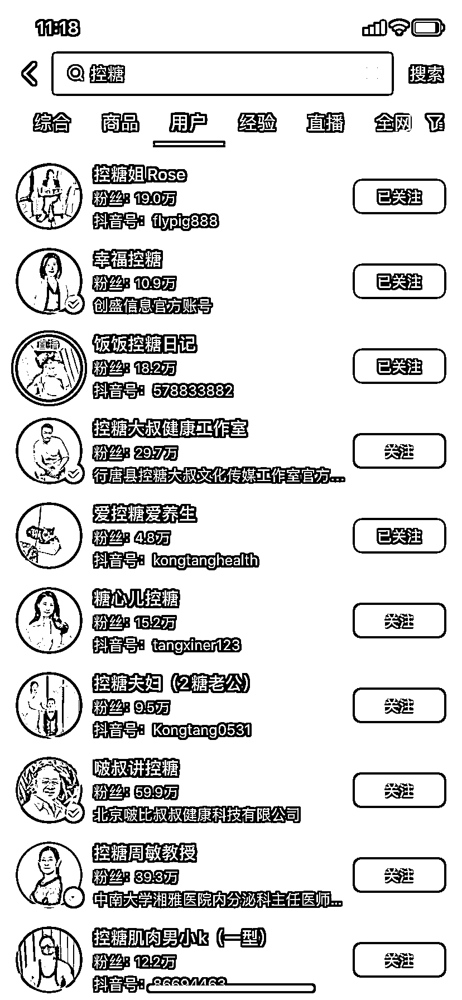
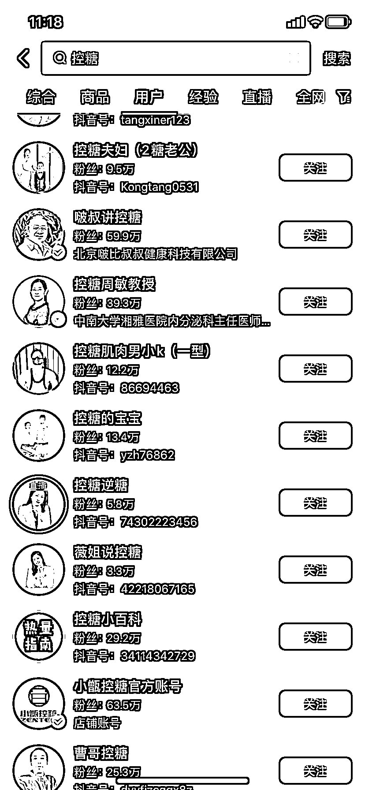
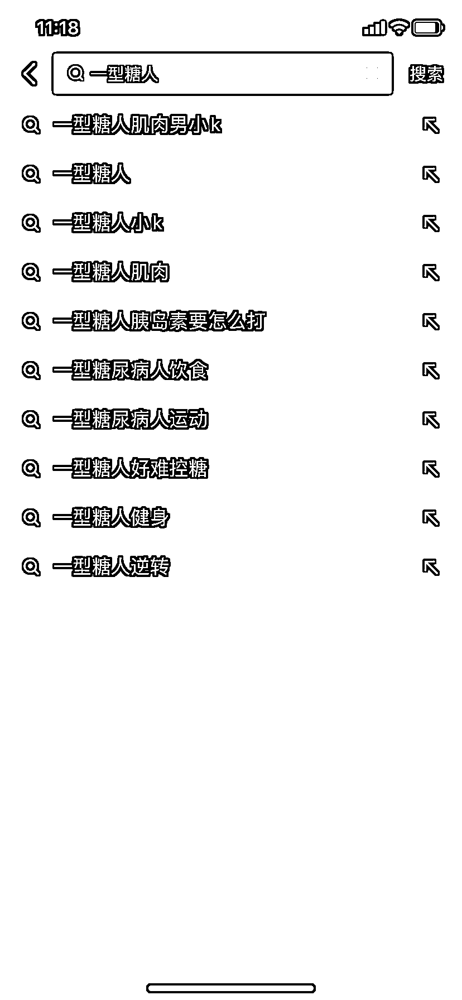

# 中国 6.5 亿人属于糖前期，未来糖尿病患者将达一半

> 原文：[`www.yuque.com/for_lazy/xkrm14/aoi7g2xv2mdywmel`](https://www.yuque.com/for_lazy/xkrm14/aoi7g2xv2mdywmel)

作者： 华姐：1783999*

日期：2023-11-27

点赞数：**51**

* * *

正文：

#风向标 中国 6.5 亿人属于糖前期 1.4 亿人是确诊的糖尿 B 群体 也就意味着未来会有一半是糖尿病患者 针对糖人这个领域：这两天研究并了解答到
目前我所看到哦看到的细分赛道 ①一对一指导控糖 ②无糖食品的带货 ③胰岛素泵 ④耗材 ⑤智能血糖仪 ⑥闭环系统 ⑦社群知识付费
目前能观察到的就这么多，大健康市场 很明朗

* * *

评论区：

朱朱侠 : 任何一种慢性病是不是都可以采用这个思路起号，然后搞矩阵？

华姐：1783999* : 别的不知道，但是这个围绕控糖应该可行，我在测试中

* * *

公众号懒人找资源，懒人专属群分享