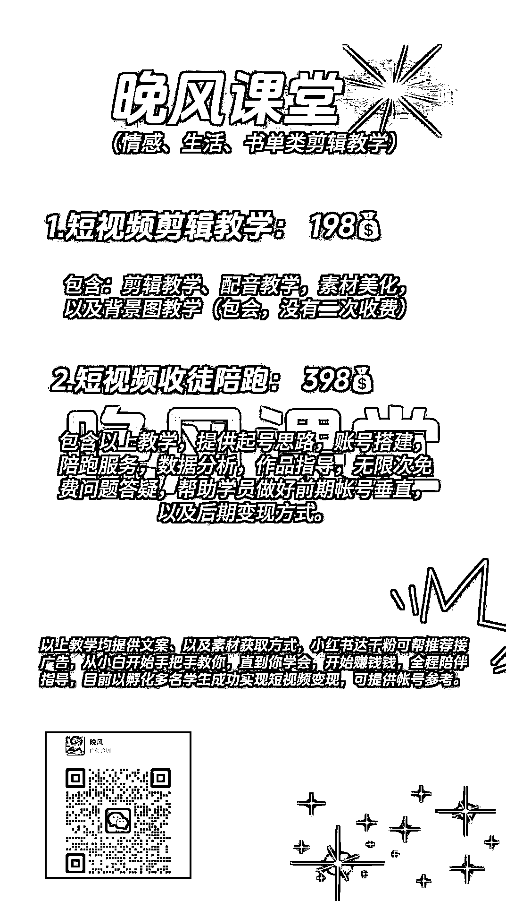
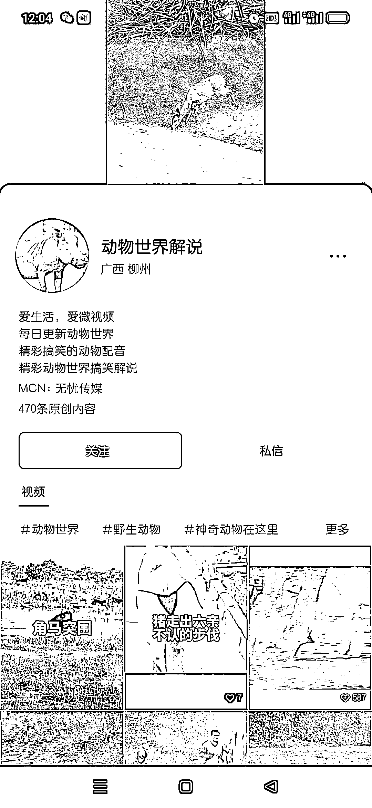

# 最近无忧传媒签约了大量漫剪情感达人，赛道火爆！

> 原文：[`www.yuque.com/for_lazy/xkrm14/ya5htvcwt1wk9buy`](https://www.yuque.com/for_lazy/xkrm14/ya5htvcwt1wk9buy)

作者： 高远

日期：2023-11-27

点赞数：**48**

* * *

正文：

大家有没有发现，最近无忧传媒在视频号签约了好多达人。 本来在刷情感赛道的账号，结果系统给我推荐了这个这个晚风来春风吹的账号。 赛道：漫剪，情感疗愈
前端变现形式： 橱窗卖书 8000+， 公众号导流，引剪辑粉， 评论区：创作者分成计划 签约 mcn：无忧传媒 后端：读书会，配音教学，陪跑，
朋友圈 3 天可见，应该是同行加的太多，怕复制走玩法。
内容选题：都是抖音上最近一个月的情感爆款文案，洗都不用洗，直接 AI 配音即可，可以随便挑个视频，直接去抖音搜，选择点赞最多，就可以找到。
优点是：能拿量，复制门槛低，打情感粉合适吗？ 缺点是：门槛低，爆量之后容易限流，单人单月可能也就千把块钱。应该还有其他玩法，希望圈友们能升维一下。
截止到发文，我看有好多签约无忧的达人在这个赛道，圈友们可以去视频号搜索关键词漫剪治愈，动漫情感情感这类的，如，冬青漫剪，小小时光 8，治愈系 vv 等；划一圈就可以。
还有其他赛道的无忧传媒也在在签约，做公众号 MCN 的可以关注下。

* * *

评论区：

* * *

