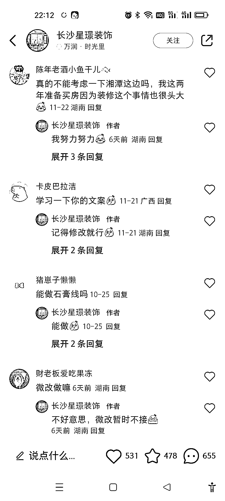

# 装修帖子突然火了，潜在客户资源

> 原文：[`www.yuque.com/for_lazy/xkrm14/dbwhc41pntofsik1`](https://www.yuque.com/for_lazy/xkrm14/dbwhc41pntofsik1)

作者： 💕guo 果||玩赚

日期：2023-11-29

点赞数：**48**

* * *

正文：

我刚刷到一个搞装修的，这条帖子突然就火了，里面好多业主询价的，我觉得是主打一个真诚吧。我觉得做其他跟装修有关的就可以到这种下面找客户，比如开荒保洁，运输垃圾，材料商，什么的。

* * *

评论区：

朱朱侠 : 第一步：做一份《新房开荒保洁避坑大全》，然后用小红书外链跳转到个人微信二维码，然后就可以在别人发的帖子下面、群里进行截留。带着鱼饵去别人的鱼塘钓鱼。先把 C 端用户搞到手。
第二步：搜当地的家政保洁公司，把客户的需求直接卖给家政保洁公司，可根据客单价收取佣金。

* * *

公众号懒人找资源，懒人专属群分享