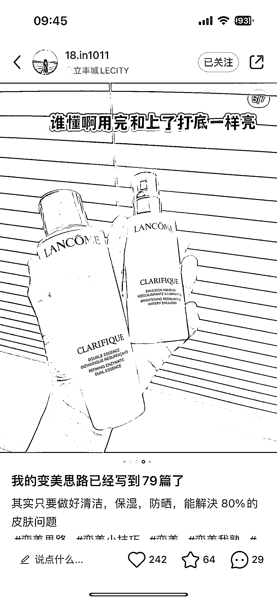

# 博主变现秘诀揭秘：垂直度、粉丝粘性、互动率是关键

> 原文：[`www.yuque.com/for_lazy/xkrm14/gop7nm62ng2wlgbb`](https://www.yuque.com/for_lazy/xkrm14/gop7nm62ng2wlgbb)

作者： 酱图森

日期：2023-11-29

点赞数：**46**

* * *

正文：

刚需人设，持续，不断发，永远是有市场的，
大多数人认为封面图都是需要露脸或者产品露出等。但是变现的关键在于内容的垂直度、粉丝粘性、互动率、还有最关键的内容价值
这个博主接的广告很多都是雅诗兰黛、兰蔻等大牌美妆

* * *

评论区：

嘉亮也叫阿叹 : 可能这种封面反而脱颖而出了

酱图森 : 玄学不好说

颖诗 Lily : 刚刚在小红书上搜这个号，简介上数值改少了😂

* * *

公众号懒人找资源，懒人专属群分享