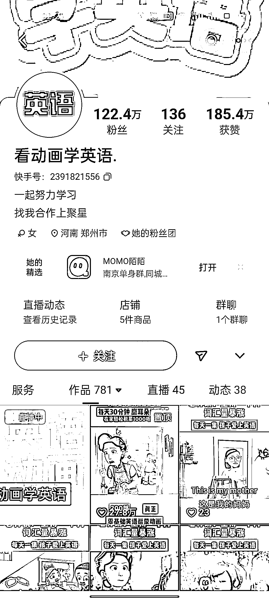

# 无人直播卖英语动画片，销量大且成本低

> 原文：[`www.yuque.com/for_lazy/xkrm14/uq71qx7zkmupe8ma`](https://www.yuque.com/for_lazy/xkrm14/uq71qx7zkmupe8ma)

作者： 志豪

日期：2023-11-27

点赞数：**44**

* * *

正文：

快手上看到一波无人直播卖英语动画片的，看了销量确实不错，大几千单的，视频风格也简单，可以统一模板剪辑。
可以扩展到对无人直播比较友好的平台，b 站之类。主要是没成本。快手基本不封不挂车的直播间。 好模仿，成本低，需求大

* * *

评论区：

小笠子麻麻 : 网盘发货吗？

志豪 : 是的

九京 : 有版权，适合小规模

志豪 : 嗯，放不大

刘皇叔 : 这种视频号也有

花满楼 : 这种有带翻译的嘛

志豪 : 有的

* * *

