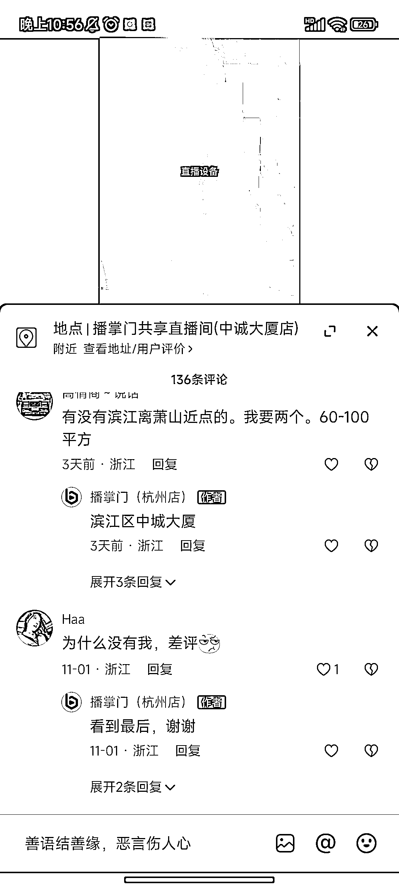
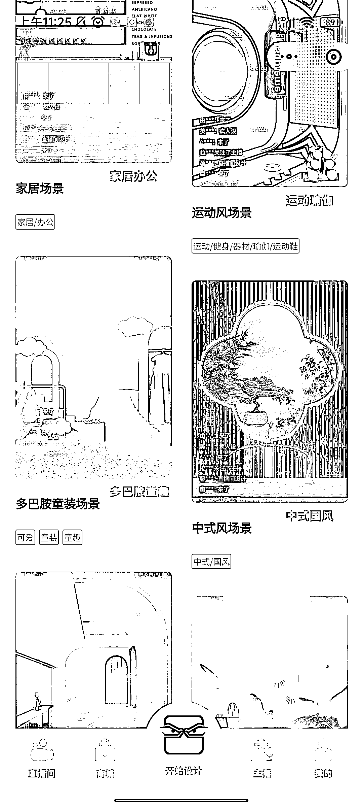
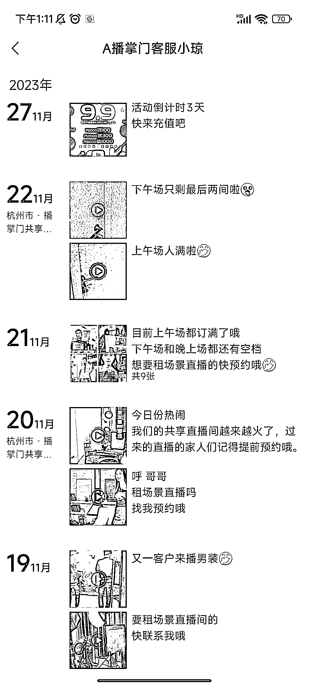

# 杭州共享直播间，含直播间场景

> 原文：[`www.yuque.com/for_lazy/xkrm14/hk12hum7gvt0taq1`](https://www.yuque.com/for_lazy/xkrm14/hk12hum7gvt0taq1)

作者： 小卢

日期：2023-11-30

点赞数：**75**

* * *

正文：

杭州共享直播间，含直播间场景，拍摄设备，灯光调试，直播价格 1 小时起租，非常适合小白或者控制测试成本的团队直播，目前来看处于蓝海市场，先拉新手小白尝试，一般来说，1-2 个月尝试期应该是有的，而且一般直播至 3-4 小时。
看了他们的小程序分为 29.59.89 元一小时三个价位，29 和 59 一天分别 6 个小时，89 价位 12 个小时，时间约满有 1600 一天。假设约满率有 50%，一天有 800，10 个直播间有 8k，一个月 24w。
场地租金:一个直播间大概 20 个平方，一个公司有 10 个直播间，总共面积有 200 个平方，租金大概为 2w 一个月。
场地搭建费用具体看不同的场景，一般一个直播间可以降低成本至 2-3k 吧，还有一些灯光及拍摄设备前期可能要投个几万块钱。哦，还有在抖音投流费用，感觉最多一个月不超过 5 万。顺利的话 1-2 个月能够回本。比如 10.9 号开始发圈，11 月中就准备开第二家店，回本挺快的，而且看他们的预约率还挺高的。

* * *

评论区：

文昭- : 要是有现成别人倒闭的直播公司，前期也能省下不少成本

小卢 : 你是会节省成本的😂

陶金金（阎老板） : 这个确实符合太多人的需求了

刘皇叔 : 你可以去视频下面问问：什么时候倒闭？记得把场地转给我[阴险]

文昭- : 哈哈 我已经找到了，明天就去看场地😁

刘皇叔 : 这执行力，等你回来告诉我们好消息！

兰陵萧生 : 期待大佬出创办细节[抱拳]

* * *

公众号懒人找资源，懒人专属群分享