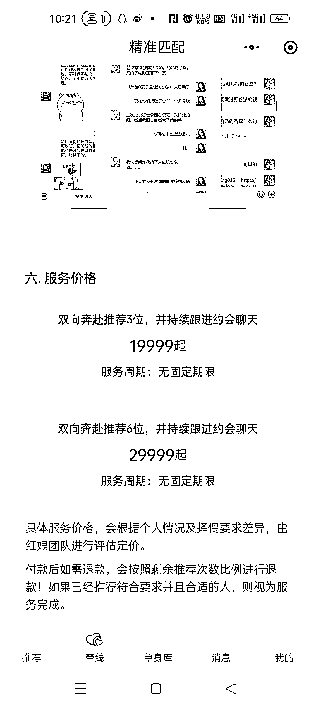

# 高端相亲服务，精准筛选同城单身人群

> 原文：[`www.yuque.com/for_lazy/xkrm14/cc2gyya8342grg0t`](https://www.yuque.com/for_lazy/xkrm14/cc2gyya8342grg0t)

作者： 愿景

日期：2023-11-27

点赞数：**29**

* * *

正文：

这个主要是做高端的相亲，图一是方案，图二是定制价格，并不便宜，图三是每天公众号分享的单身人群，文章里面有一个小程序会填写一下基本信息，里面会充值等，筛选的都是精准的人，如果做同城相亲的可以考虑这种模式，也是公众号+小程序，主要做同城的这种

* * *

评论区：

艾小飞 : 我之前做过[捂脸]那时候 99%女生的资料，都是自编的，图片都是小红书上照搬过来的，目的就是为了吸引男的来找我付费，效果还不错，一天也有个几百块，但后来被人举报抖音被封了，微信也封了，就不干了，刚刚我看了下他的账号，他这个资料，多少也有点“水分”含量

恒一 : 路人甲的公众号把

愿景 : 果然都是真真假假，假假真真

愿景 : 这个倒是不晓得，我倒是关注了一个路人甲公众号只不过是写文章方面得

艾小飞 : 对滴，要不然刚开始你很难去找这么多资源来宣传的，只能自编虚假的信息去吸引男人付费

蕉太狼 : 这号收费，我从开始关注的 3000 多，到现在 30000 多，收费真狠啊[撇嘴]

* * *

公众号懒人找资源，懒人专属群分享