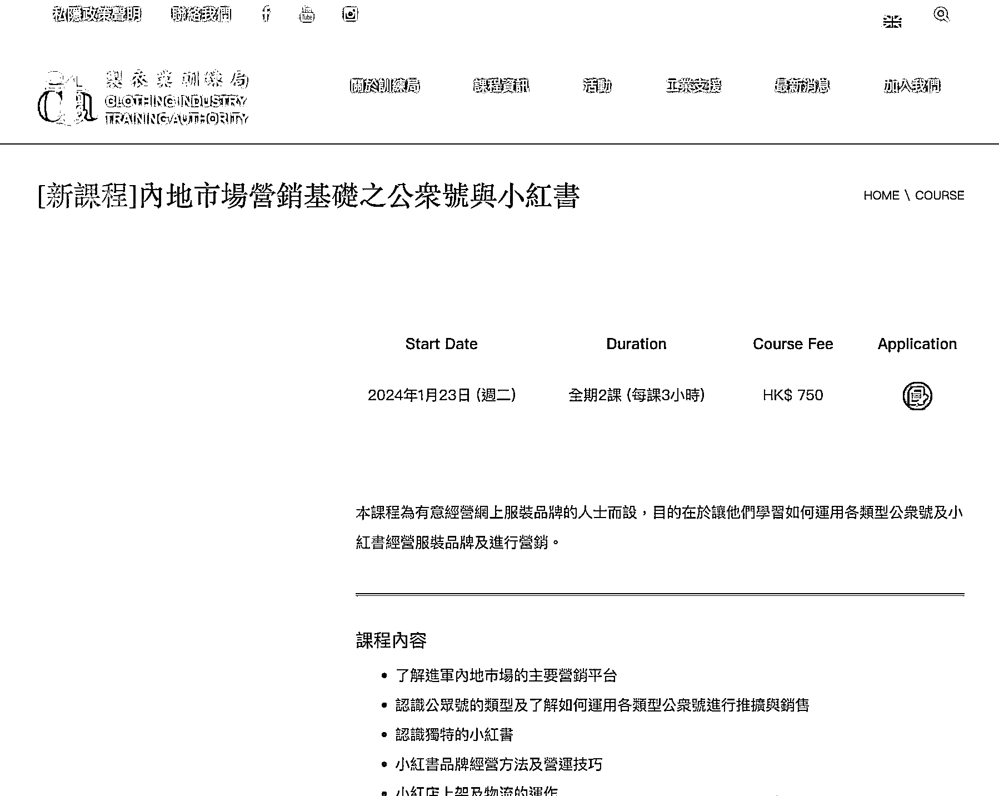

# 香港本土推出线下知识付费课程，公众号和小红书市场营销课程受关注

> 原文：[`www.yuque.com/for_lazy/xkrm14/ib75y44wgr25a4fi`](https://www.yuque.com/for_lazy/xkrm14/ib75y44wgr25a4fi)

作者： 纳兰乘风

日期：2023-11-27

点赞数：**28**

* * *

正文：

香港本土的线下知识付费，有公众号和小红书的市场营销课程了，线下班 6 小时 750 港币，感觉他们那边这种自媒体的知识付费课程才刚起步…

* * *

评论区：

九京 : 有点意思

* * *

