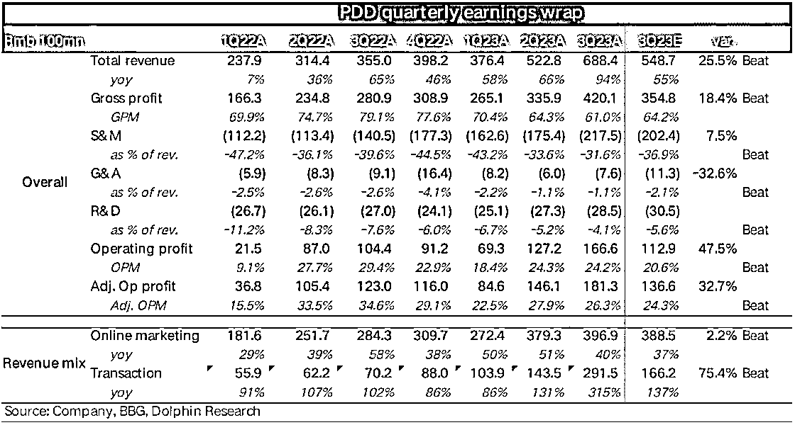

# 拼多多三季度营收创历史新高，同比增长 94%

> 原文：[`www.yuque.com/for_lazy/xkrm14/evv9yr6agm970g05`](https://www.yuque.com/for_lazy/xkrm14/evv9yr6agm970g05)

作者： 葱葱冲

日期：2023-11-28

点赞数：**16**

* * *

正文：

11 月 28 日周二美股盘前，拼多多公布了截至 2023 年 9 月 30 日的三季度业绩，财报显示，三季度营收 688.4 亿元，同比增长 94%，再创历史新高，市场预期为 537.7 亿元，较上季度 66.3%的增速再加速。关注股市、跨境和入局 Temu 的圈友可以关注下

* * *

评论区：

* * *

