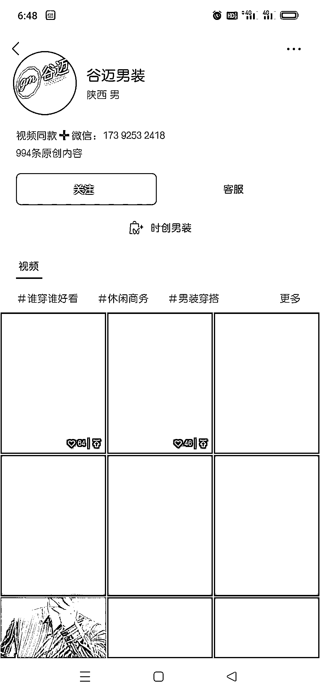
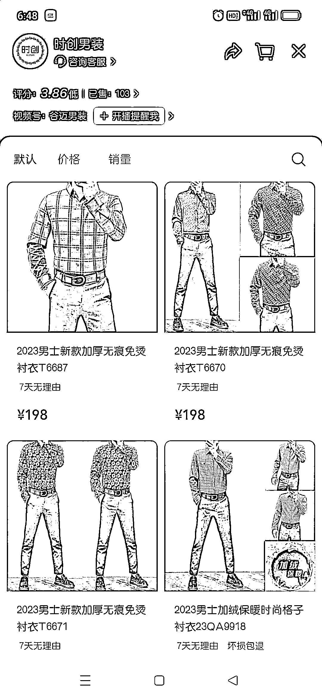
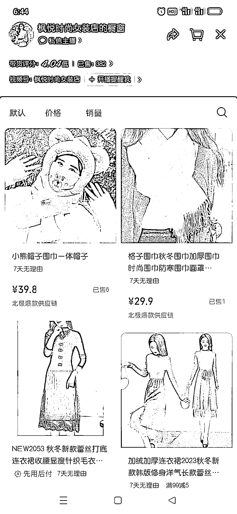

# 视频号中老年轻奢男装，客单价 199，运营 1 年零一个月，卖出 1000 件左右

> 原文：[`www.yuque.com/for_lazy/xkrm14/gtwmlnhcz5tr8nqp`](https://www.yuque.com/for_lazy/xkrm14/gtwmlnhcz5tr8nqp)

作者： 高远

日期：2023-11-29

点赞数：**77**

* * *

正文：

视频号中老年轻奢男装，客单 199，两个号卖了 1000 件左右，发了 1900 多个固定模板视频，运营 1 年零一个月。抖音 1.0，2.0 时代的制作形式。
优点:不费事，日更压力小，客单价高，能熬。 缺点：本身不是这个领域的，需要解决的卡点多。
新手非要做，可以看一下枫悦时尚女装店，AI+服装号，橱窗卖了 382 件，昨天我记得好像是 377 吧。

* * *

评论区：

* * *

