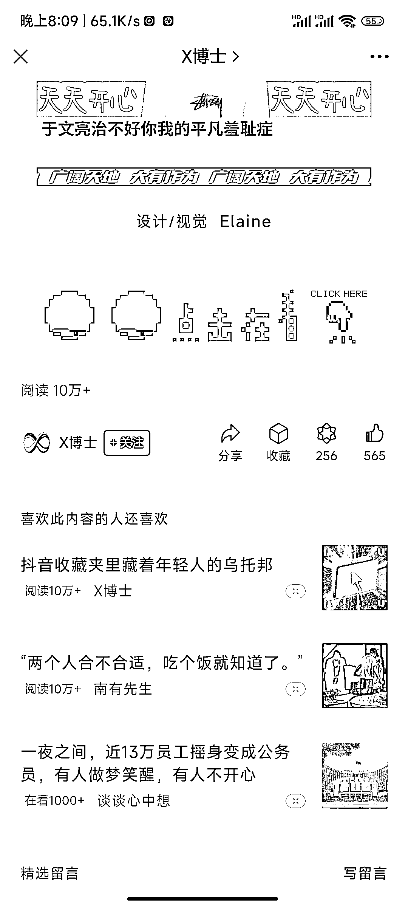

# 如何通过微信“看一看”找到爆文和对标账号

> 原文：[`www.yuque.com/for_lazy/xkrm14/uz0hye8iaggddrgp`](https://www.yuque.com/for_lazy/xkrm14/uz0hye8iaggddrgp)

作者： 浮生若梦

日期：2023-11-27

点赞数：**78**

* * *

正文：

分享一个找公众号爆文的技巧，用一个微信小号，一个公众号都不关注，然后去微信“看一看”里面刷对标账号和爆款文章，然后你就会发现订阅号推荐的文章全是爆文，然后我们还可以点进文章里面拉到末尾在看，也全是爆款文章和对标账号

* * *

评论区：

* * *

公众号懒人找资源，懒人专属群分享