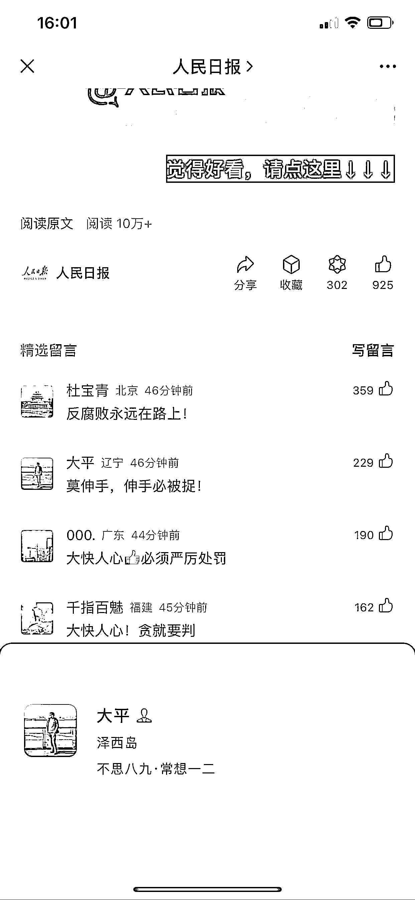
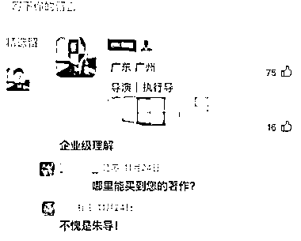

# 微信最新更新：个性签名成为私域引流的新途径

> 原文：[`www.yuque.com/for_lazy/xkrm14/vbq06z9egpt92exn`](https://www.yuque.com/for_lazy/xkrm14/vbq06z9egpt92exn)

作者： 林林 AIGC 写作

日期：2023-12-01

点赞数：**106**

* * *

正文：

微信最新一次更新，让我们又多了一个不错的私域引流的途径。 当你打开留言的用户的头像，无论是安卓、iOS 还是 macOS 端口都能直接回传留言的用户的个性签名。
如果你急需私域引流，你也可以在个性签名栏留一个钩子，让更多目标客群添加你的微信，成为你的私域流量。

* * *

评论区：

火花小怪兽 : 厉害

阿陌 : 学到了

王左右 : 如果是有视频号的，点击头像可以达到视频号，可直接点击关注

AQ : 我之前写过这个，没中签，还是自己没写好，向你学习💪

* * *

