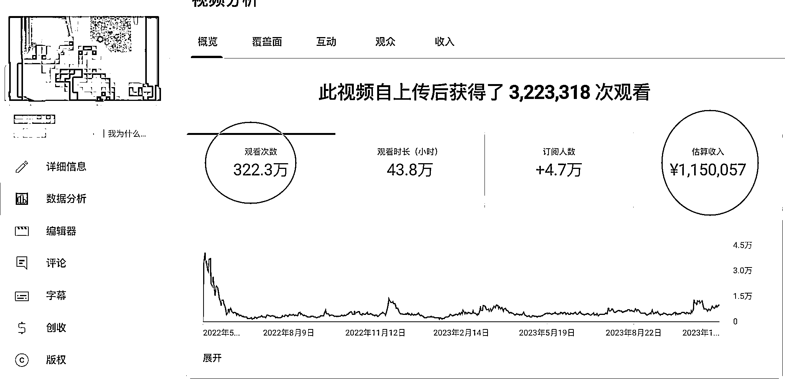

# 油管上的真实收益，来自某个大 V

> 原文：[`www.yuque.com/for_lazy/xkrm14/rhemr4h2g6b7g7th`](https://www.yuque.com/for_lazy/xkrm14/rhemr4h2g6b7g7th)

作者： 鸭王 biubiu

日期：2023-11-28

点赞数：**71**

* * *

正文：

油管上的真实收益，来自某个大 V 三百多万播放，广告收益大概￥1,150,057 日元 换算人民币五万五千多块钱，油管的收益是真的高。。。

* * *

评论区：

林林 AIGC 写作 : 这是某位键政大哥吧😂

无穷远… : 这可是王局[捂脸]

林林 AIGC 写作 : 果然是键政的

骄志 : 来来回回也就那点事 看腻老王了

三番 : 有人知道这个数据是怎么查的？

毛豆 : 31 分钟的视频，万次播放 170 元，以这个大 v 在油管的影响力，还好，不算高，甚至低了。另一个他的同行才高，油管平均 20 多分钟的视频，万播 340 元

毛豆 : 有第三方网站可以查，但是有些可以参考，大部分是比较离谱的，和实际收入相去甚远。像现在这个，是本人自曝的[憨笑]

早早 : 这个可以搞起[呲牙]

* * *

公众号懒人找资源，懒人专属群分享