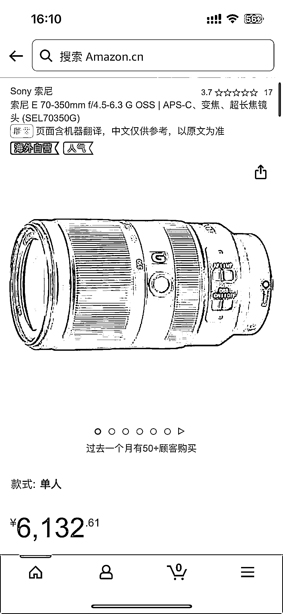

# 利用价格插件监测亚马逊活动差价，省去蹲点时间成本

> 原文：[`www.yuque.com/for_lazy/xkrm14/gkxo5id0y6wcf52b`](https://www.yuque.com/for_lazy/xkrm14/gkxo5id0y6wcf52b)

作者： 志豪

日期：2023-11-28

点赞数：**54**

* * *

正文：

亚马逊活动差价，小红书有搜索需求（亚马逊蹲优惠➕商品），举个相机镜头的例子，差价 2k 左右，但活动不定时，天天蹲时间成本太高，可以用价格插件监测，有降价可以第一时间发现，插件举例 keepa，也可用其他代替，平台、商品均可替换，还有可以引流入群蹲优惠

* * *

评论区：

* * *

