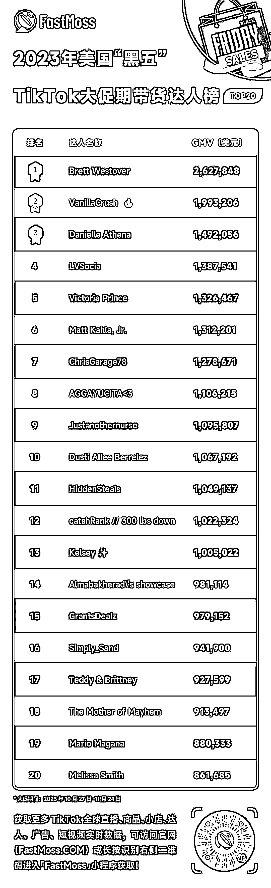
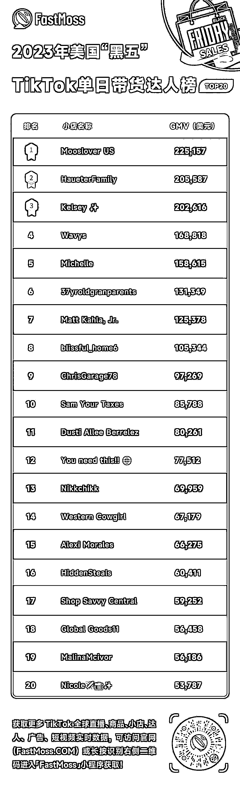
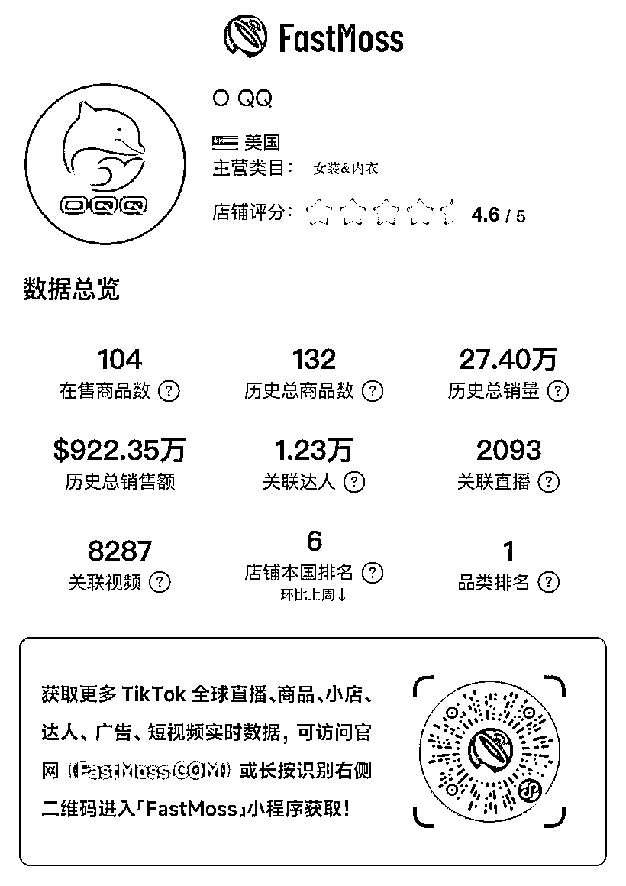

# TikTok 美国小店黑五大促销售额飙升，美妆个护品成最畅销品类

> 原文：[`www.yuque.com/for_lazy/xkrm14/hclhtkpbpvdwr41m`](https://www.yuque.com/for_lazy/xkrm14/hclhtkpbpvdwr41m)

作者： 浩野

日期：2023-11-27

点赞数：**34**

* * *

正文：

TikTok 美国小店于今年 1 月开始内测，6 月正式开放，8 月开始正式运营。在短短不到 3 个月的时间里，TikTok 美国小店的销售额实现了从 5 月份的 30 多万美金到 8 月份的 500 多万美金，再到 10 月份的 1000 多万美金，直至 11 月的 3300 多万美金的飞速增长。今年的“黑色星期五”（简称黑五）TikTok
Shop 美区正式上线后的首次大促，成功提交了几乎完美的答卷。FastMoss 独家数据显示，今年“黑色星期五”大促期间（10 月 27 日-11 月 24 日），美国 TikTok
Shop 单日（11 月 24 日）GMV 超 3300 万美元。其中占比最大的美妆个护品类 GMV 约为 535.43 万美元，小店 The
Beachwaver 以单日约 110.43 万美元销售额领跑。而本次 TikTok 美区爆发式增长不仅来自短视频，TikTok 美区直播间也同样迎来了快速增长，此次“黑五”期间，美区最高直播间销售额 GMV 约为 42.69 万美元。
在黑五大促期间（10 月 27 日-11 月 24 日），美妆个护、女装&内衣、手机&数码、收藏品、运动&户外是 TikTok
Shop 美国站最畅销的五大品类。其中，美妆个护品类在大促期间，总共创造了 1.3 亿美元的 GMV，为第一大品类；女装&内衣以超 7000 万美元 GMV 成为第二大畅销品类；手机&数码则排行第三，创下近 5000 万美元的 GMV。另外，保健类目小店 rysesupps、美妆个护类目小店 Tarte
Cosmetics 以及家具类目小店 Sweet Furniture 等进入黑五美区 TikTok Shop 榜单 TOP10。

* * *

评论区：

* * *

