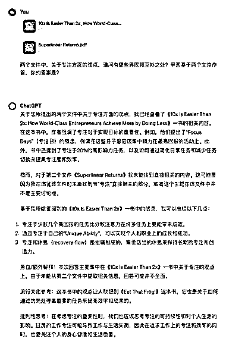
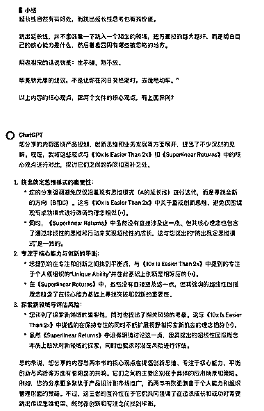
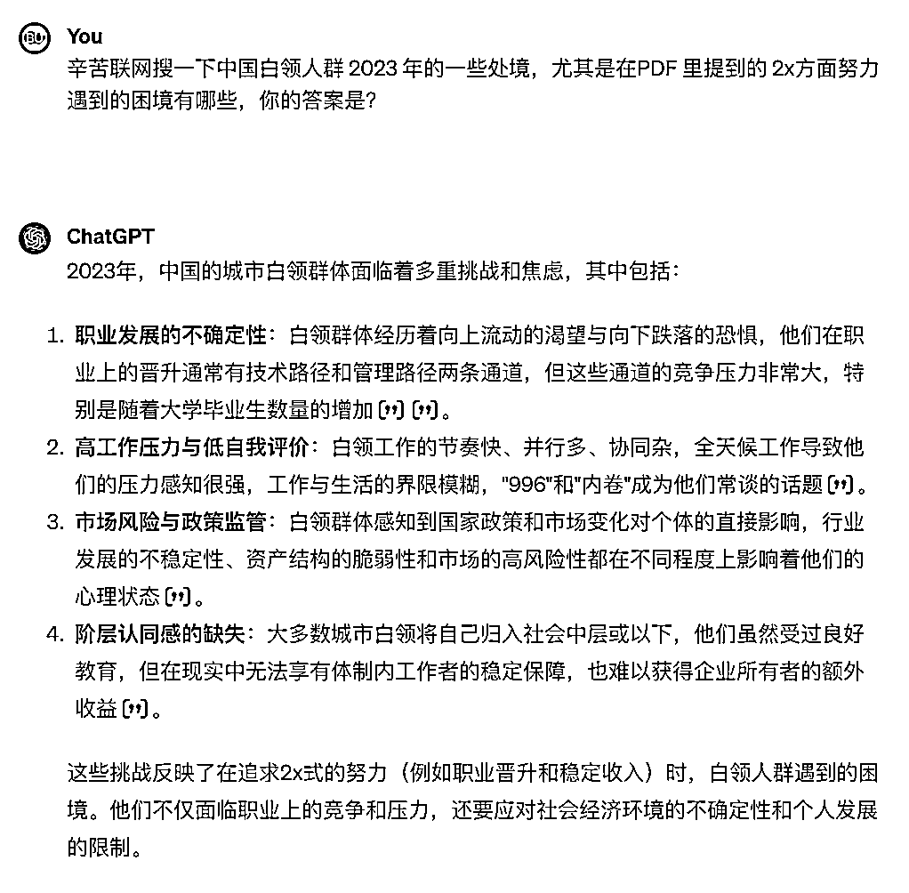

# ChatGPT 一次性读完近 300 页英文书，同时分析多本书

> 原文：[`www.yuque.com/for_lazy/xkrm14/cxkx7cgvu90kis0f`](https://www.yuque.com/for_lazy/xkrm14/cxkx7cgvu90kis0f)

作者： 杨昌

日期：2023-11-28

点赞数：**64**

* * *

正文：

狂喜，ChatGPT 可以一次性读完近 300 页英文书了，而且可以同时分析多本书，对比着读。 一、 今天试着用 ChatGPT 读了下挺火的《10x Is
Easier Than 2x》，发现 270 页全部读下来，也没太大问题。
好几个章节，我有简单对比过原文，没发现明显的出入。顺便吐槽一句，这本书的原文可读性真心不高～ 对啦，因为直接用的 ChatGPT 网页版，我终于不太担心
token 的消耗。这是我第一次感觉到，20 美刀/月的订阅费，实在太赚了。 二、 刚好，我最近也看了美国互联网界的教父级人物 Paul Graham
最新博客《Superlinear Returns》，感觉两者的核心观点有一定的异同和互补之处。 于是，我找到英文博客原文，把整个网页打印成
PDF，然后跟《10x Is Easier Than 2x》一同上传到 ChatGPT 上。没想到，效果真不错，比我自己挨个读完比较，还有洞察，比如：
1、异同： 《10x Is Easier Than 2x》侧重于目标设定和效率提升的策略，而《Superlinear
Returns》则更多地探讨了性能回报的非线性增长和市场机制。 前者关注的是个体如何通过改变思维方式来提高成就，后者则关注的是宏观环境中的机遇和挑战。
2、互补： 这两本书在某种程度上是互补的。 《10x Is Easier Than
2x》提供了关于如何设定和实现高目标的实用策略，而《Superlinear
Returns》则提供了一个更广泛的视角来理解这些目标在更大的市场和社会环境中如何运作。
两者结合起来，为读者提供了一个全面的框架，既包括个人发展策略，也包括对外部市场力量的理解。 三、 在直接读 PDF 方面，GPT-4 turbo
（128k）准确度还是不错的，比 Claude 2.1（200k）都强不少。PDF 里面没有的内容，他也不会瞎展开（如图二），这个就很不错。
以前总想着，能不能搞个 learning agent 去解决知识间联系的事儿。现在发现，似乎也可以不用那么麻烦，甚至都可以不咋花钱，直接把对应的知识都整理到
PDF 里，一次性喂进去就得了。 我还尝试过一些别的办法，比如复制《产品沉思录》里一段话进去对比（图三），或者干脆让 ChatGPT
去搜时下的新闻去做结合（图四），也都能给出一些还行的反馈来。

* * *

评论区：

阿黎 : 很棒，可以做个产品出来

强哥手记 : 做一个 GPTs 出来？

灯火煌煌 : 用什么插件？askpdf 吗？还是 chatpdf？

杨昌 : ChatGPT 网页版哈

杨昌 : 你也可以

灯火煌煌 : 不用插件吗

杨昌 : 嗯呢 你试一下啊

小梦 : 为啥我之前试了，全部是一派胡言，看到给我的反馈头大

* * *

