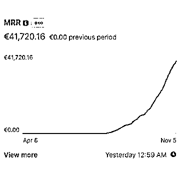

# AI 虚拟女友：年收入 50 万美元的新兴市场

> 原文：[`www.yuque.com/for_lazy/xkrm14/wkx6ntfrczktss04`](https://www.yuque.com/for_lazy/xkrm14/wkx6ntfrczktss04)

作者： 宋东波-进击 2030

日期：2023-11-30

点赞数：**64**

* * *

正文：

国外有个做 AI 虚拟女友的，刚晒了收入，$50 万美元年收入。看网站，主打就是 AI 聊天，抓紧搞起来。

* * *

评论区：

能量菌 : 国内也复制嘛

宋东波-进击 2030 : 色是人性第一大需求 加油💪

冬日暖阳 : 这个是什么平台呢

宋东波-进击 2030 : 感谢亦仁。

牧言木语 : 这个怎么做呀？

宋东波-进击 2030 : 见图三

文少 : AI 聊天靠打赏赚钱吗

* * *

