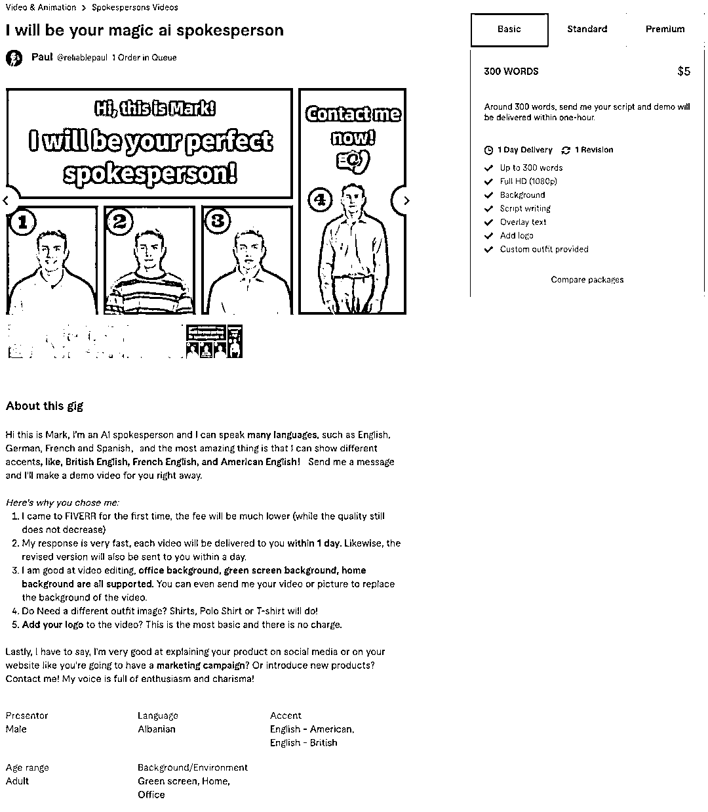

# 在 Fiverr 平台上明码标价出售 AI 相关服务

> 原文：[`www.yuque.com/for_lazy/xkrm14/oc772g8facuprblz`](https://www.yuque.com/for_lazy/xkrm14/oc772g8facuprblz)

作者： Sunwei

日期：2023-11-28

点赞数：**42**

* * *

正文：

在 Fiverr 平台上明码标价出售 AI 相关服务。
Fiverr 上热销的 AI 服务包括以下几类，一种是基于 AI 工具提供图文、视频、网站等制作服务；还有创作者会根据 AI 内容进行完善，提供解决方案。
每项服务的定价从 5 美元开始，最高可达数千美元。不过，Fiverr 上的佣金为 20%，也就是说一个 100 美元的订单，平台抽成为 20 美元。
[用 AI 搞副业日赚近 3 万，零工陷阱还是掘金秘诀？](https://mp.weixin.qq.com/s/WeLUH4Ca_LAw27laG7WhCA)

* * *

评论区：

* * *

公众号懒人找资源，懒人专属群分享