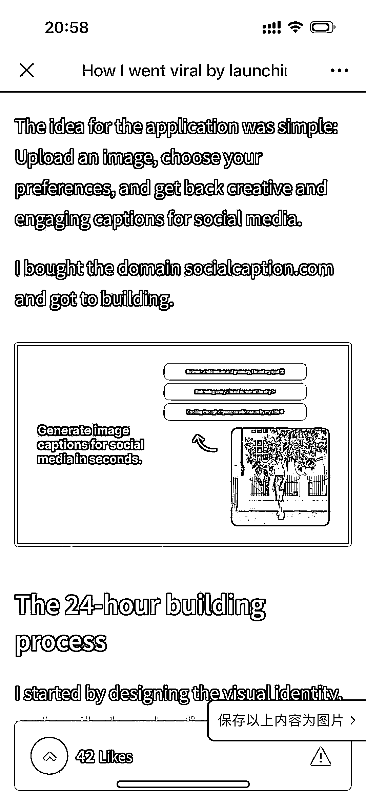
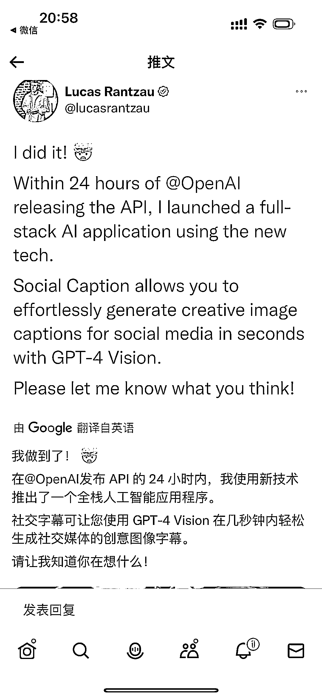

# 一天内上手海外工具站，利用 GPT4 API 生成媒体文案，获得 170K 曝光

> 原文：[`www.yuque.com/for_lazy/xkrm14/opqrbozgq8lzm8pe`](https://www.yuque.com/for_lazy/xkrm14/opqrbozgq8lzm8pe)

作者： 易博

日期：2023-11-27

点赞数：**42**

* * *

正文：

海外工具站，一天利用 GPT4 API 做的网站，上传图片后生成媒体文案，在 X 上发布后，获得 170K 曝光。难度不大，很容易上手，How I went
viral by launching an AI app in 24 hour...

in-24-hours-1fe549fa32)

* * *

评论区：

* * *

公众号懒人找资源，懒人专属群分享