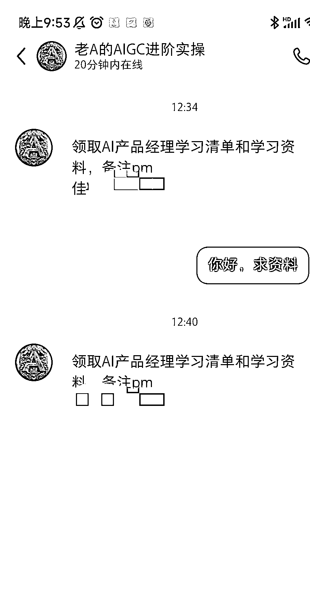

# AI 创业公司崛起，AI 岗位需求大增，薪资水平也随之提高

> 原文：[`www.yuque.com/for_lazy/xkrm14/sglp71m0ryf0ek59`](https://www.yuque.com/for_lazy/xkrm14/sglp71m0ryf0ek59)

作者： 小卢

日期：2023-11-28

点赞数：**42**

* * *

正文：

最近很多 ai 创业公司出来，ai 新岗位的需求也大量增加，由于大部分人还不懂得如何运用 ai，因此原先的岗位+AI 两字，岗位薪资都会更高一些，比如 AI 产品经理，AI 内容运营。
这个小红书博主最开始是分享 gpt 的一些内容及最新资讯，后面发了一篇 AI 产品经理的内容，很多人在下面求资料。目前的变现方式可以是把人引到微信发资料及学习清单，如果自己已经是 ai 产品经理，其实自己可以开一个训练营教有产品经理经验的人如何转行、1v1 简历指导，面试咨询等服务。同理其他 ai 行业的也可以这样变现。

* * *

评论区：

* * *

