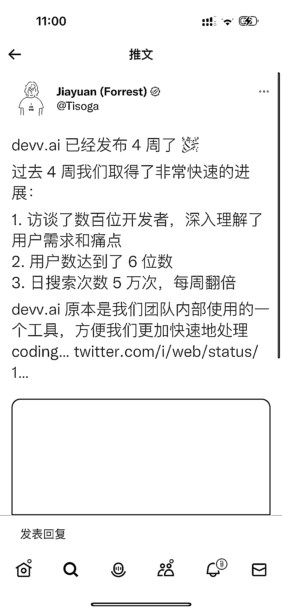
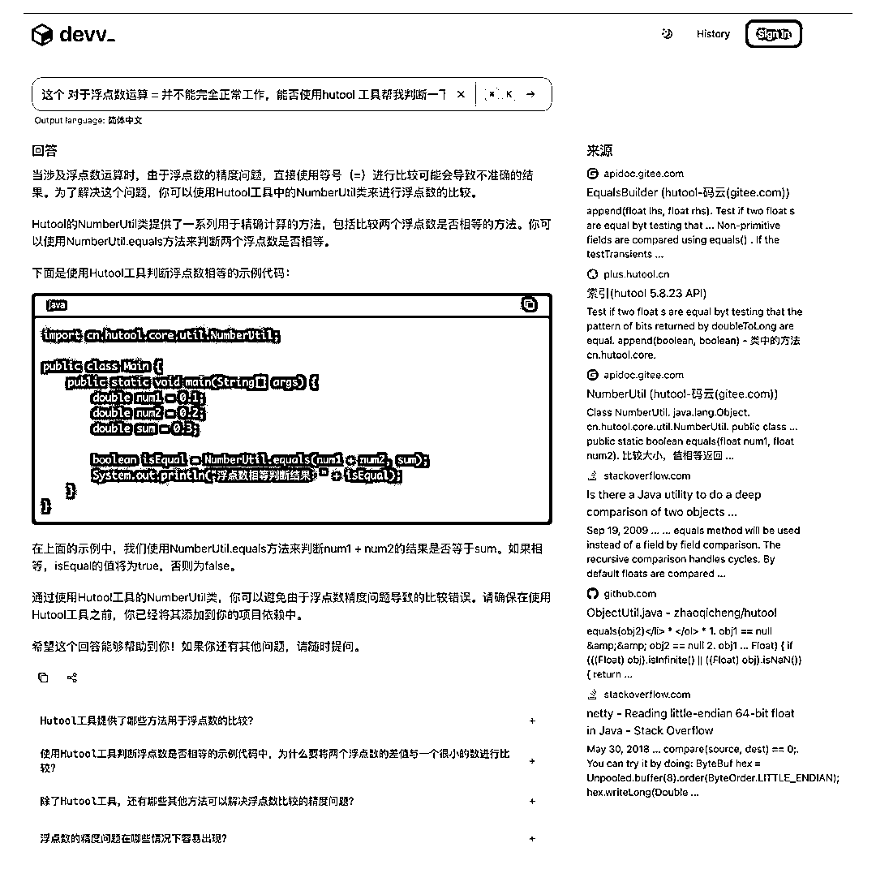
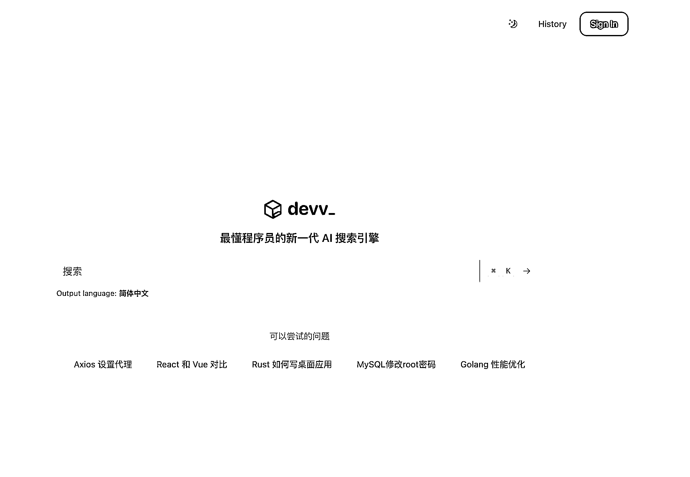

# 一款最懂程序员的 AI 搜索引擎，获得六位数用户和一线美元基金支持

> 原文：[`www.yuque.com/for_lazy/xkrm14/zs0rdov8yewt3rrq`](https://www.yuque.com/for_lazy/xkrm14/zs0rdov8yewt3rrq)

作者： 易博

日期：2023-11-29

点赞数：**40**

* * *

正文：

jiayuan 发布的 devv.ai 四周内收获六位数用户，本身是 X 大 V，为团队内部产品孵化，一线美元基金支持。产品号称「最懂程序员的新一代 AI
搜索引擎」 这是一个基于文档、代码、实时搜索数据从零到一构建了一套高效、准确的 RAG 系统，底层的模型基于微调后的 Code Llama 和
GPT-3.5。 体验非常好，速度快、准确、免费。
[`twitter.com/tisoga/status/1729686270941778...`](https://twitter.com/tisoga/status/1729686270941778103?s=46&t=NwRcdbUrzNatZJ8gidt_XQ) 

* * *

评论区：

* * *

