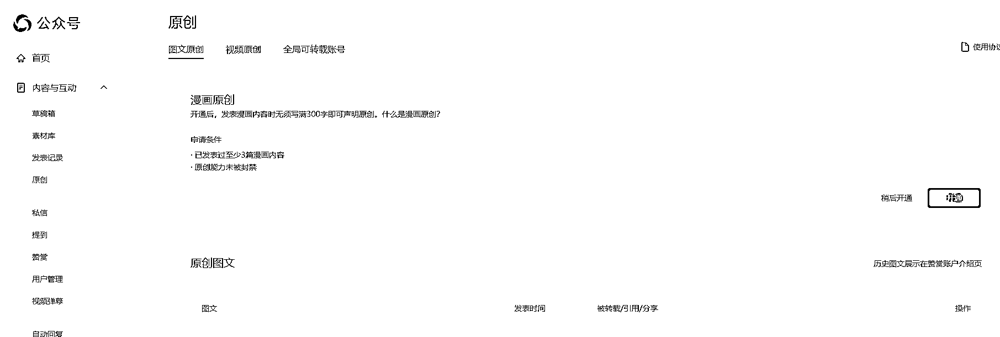

# 新申请的公众号推出（漫画原创）频道，AI 增加收入来源

> 原文：[`www.yuque.com/for_lazy/xkrm14/pk2rpnssdzlway43`](https://www.yuque.com/for_lazy/xkrm14/pk2rpnssdzlway43)

作者： Lumi

日期：2023-12-05

点赞数：**54**

* * *

正文：

新申请的公众号推出了一项名为【漫画原创】频道 ai 又多了一个收入来源 开通后，发表漫画内容时无须写满 300 字即可声明原创。 申请条件
已发表过至少 3 篇漫画内容 原创能力未被封禁 利用漫画创作公众号爆款文章，吸引粉丝，同时实现双重收益。
公众号一直拥有推荐池，只要在垂直领域持续每日更新，便有机会进入推荐池。 使用 AI 技术可以帮助我们绘制漫画和编写故事，图片制作相对简单，每篇文章只需几张图片。
生财朋友圈

* * *

评论区：

花闲 : 请问 ai 漫画用什么软件？

财火 : 问题关键是怎么用 AI 创建漫画[调皮]

张瑞泽 * : 这个可能 AI 生成不了，

蛋壳 : 可以生成

张瑞泽 * : 怎么生成，可以教一下嘛？

蛋壳 : 付费不

maomao : 3

* * *

