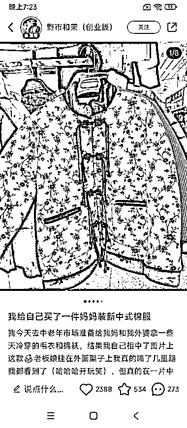

# 小红书中老年市场崛起，60+穿搭成为流行趋势

> 原文：[`www.yuque.com/for_lazy/xkrm14/vx3c7vdx07yv77eg`](https://www.yuque.com/for_lazy/xkrm14/vx3c7vdx07yv77eg)

作者： 🍀 刘梅子🌱

日期：2023-12-06

点赞数：**85**

* * *

正文：

小红书也有中老年的市场，有新号粉丝量不高，出单还不错，60+的穿搭也可以成为流行，也会考虑为自己的妈妈购买吧

* * *

评论区：

🍀 刘梅子🌱 : 谢谢亦仁老师✌️

BLUE : 这个定位是送长辈？还是长辈下单？

🍀 刘梅子🌱 : 送长辈

🍀 刘梅子🌱 : 送长辈的群体更大吧

能量菌 : 无货源电商么？

🍀 刘梅子🌱 : 你如果有货源肯定更好呀

Kos : 这个思路还是很不错的。 小红书女性朋友多一些。遇到合适的能送长辈的东西会顺手下单的。

* * *

公众号懒人找资源，懒人专属群分享