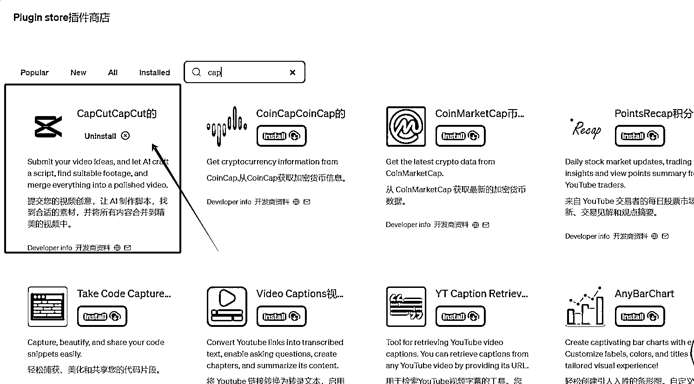

# ChatGPT 推出剪映插件，实现 AI 短视频制作

> 原文：[`www.yuque.com/for_lazy/xkrm14/ko412y5za72c3nkk`](https://www.yuque.com/for_lazy/xkrm14/ko412y5za72c3nkk)

作者： 欣欣

日期：2023-12-08

点赞数：**96**

* * *

正文：

chatgpt 出了个剪映插件，真的可以 ai 短视频了

* * *

评论区：

黄小刀 : [流泪][流泪][流泪]是，可以自动切割

华仔 : 可以跟我们的要求自己处理视频吗[呲牙]

飞掌柜 : 我试了下，点击“查看视频”按钮，404 报错，不知道有和我一样情况的吗？

飞掌柜 :

每天晒白牙 : 这个看起来有点牛逼

11 : 试了几次，感觉没啥用，其实就和剪映里的文案生视频一样的逻辑，本质上这个就是剪映的在线版。省略了一个自己创作文案的过程。

能量菌 : 生成的模板有剪映多嘛

* * *

公众号懒人找资源，懒人专属群分享